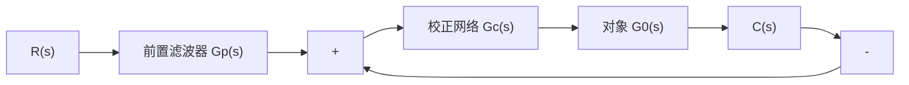

# 1. 前置滤波组合校正

为了改善系统性能，在系统中常引入形如 $G_{c}(s) = (s + z) / (s + p)$ 的串联校正网络，以改变系统的闭环极点。但是， $G_{c}(s)$ 同时也会在系统闭环传递函数 $\Phi(s)$ 中增加一个新的零点。这个新增的零点可能会严重影响闭环系统的动态性能。此时，可考虑在系统的输入端串接一个前置滤波器，以消除新增闭环零点的不利影响。

例 6-6 设带有前置滤波器的控制系统如图 6-24 所示。图中，被控对象为 $G_{0}(s)=\frac{1}{s}$ ，串联校正网络为 PI 控制器， $G_{c}(s)=K_{1}+\frac{K_{2}}{s}=\frac{K_{1}s+K_{2}}{s}$ ， $G_{p}(s)$ 为前置滤波器。系统的设计要求为：

(1) 系统阻尼比 $\zeta_{d}=\frac{1}{\sqrt{2}}=0.707$ ;

(2) 阶跃响应的超调量 $\sigma\% \leqslant 5\%$ ;  
(3) 阶跃响应的调节时间 $t_{s} \leqslant 0.6 \, \text{s} (\Delta = 2\%)$ 。

试设计 $K_{1}, K_{2}$ 及 $G_{p}(s)$ 。

flowchart

图 6-24 带前置滤波器的控制系统

解 图 6-24 系统的闭环传递函数为

$$\Phi (s) = \frac {(K _ {1} s + K _ {2}) G _ {p} (s)}{s ^ {2} + K _ {1} s + K _ {2}}$$

闭环系统特征方程为

$$s ^ {2} + K _ {1} s + K _ {2} = s ^ {2} + 2 \zeta_ {d} \omega_ {n} s + \omega_ {n} ^ {2} = 0$$

根据系统对阻尼比和调节时间的要求，令 $\zeta_{d} = 0.707$ ，且由

$$t _ {s} = \frac {4 . 4}{\zeta_ {d} \omega_ {n}} \leqslant 0. 6 \quad (\Delta = 2 \%)$$

求得 $\zeta_d\omega_n\geqslant 7.33$ 。现取 $\zeta_d\omega_n = 8$ ，故得 $\omega_{n} = 8\sqrt{2}$ 。于是求出PI控制器参数

$$K _ {1} = 2 \zeta_ {d} \omega_ {n} = 1 6, \quad K _ {2} = \omega_ {n} ^ {2} = 1 2 8$$

若不引入前置滤波器，相当于 $G_{p}(s) = 1$ ，则系统的闭环传递函数为

$$\Phi (s) = \frac {1 6 (s + 8)}{s ^ {2} + 1 6 s + 1 2 8} = \frac {\omega_ {n} ^ {2}}{z} \cdot \frac {s + z}{s ^ {2} + 2 \zeta_ {d} \omega_ {n} s + \omega_ {n} ^ {2}}$$

上式表明，此时系统为有零点的二阶系统。根据 $\zeta_{d} = 1 / \sqrt{2},\omega_{n} = 8\sqrt{2},z = 8$ 以及式(3-42)

$$c (t) = 1 + r e ^ {- \zeta_ {d} \omega_ {n} t} \sin (\omega_ {n} \sqrt {1 - \zeta_ {d} ^ {2}} t + \psi)$$

再由式(3-43)，式(3-44)及式(3-46)，可得

$$r = \sqrt {z ^ {2} - 2 \zeta_ {d} \omega_ {n} z + \omega_ {n} ^ {2}} / z \sqrt {1 - \zeta_ {d} ^ {2}} = 1. 4 1\beta_ {d} = \arctan \frac {\sqrt {1 - \zeta_ {d} ^ {2}}}{\zeta_ {d}} = \frac {\pi}{4}\psi = - \pi + \arctan \left[ \omega_ {n} \sqrt {1 - \zeta_ {d} ^ {2}} / (z - \zeta_ {d} \omega_ {n}) \right] + \arctan \left(\sqrt {1 - \zeta_ {d} ^ {2}} / \zeta_ {d}\right) = - \frac {\pi}{4}$$

于是，无前置滤波器时，系统的动态性能可由图3-23及式(3-45)，式(3-47)及式(3-49)算得为
