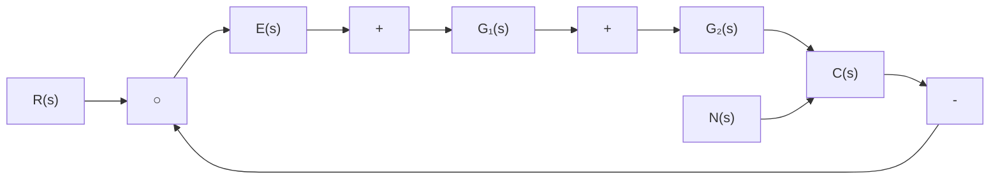
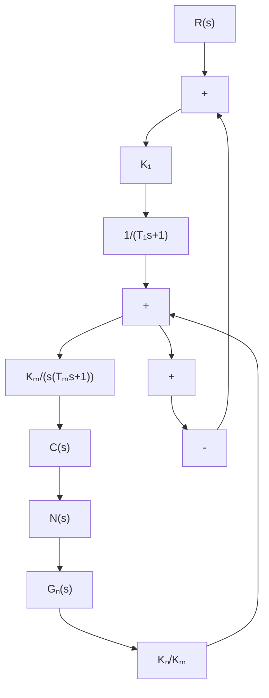

# 2. 按扰动补偿的复合校正

flowchart

图 6-30 按扰动补偿的复合控制系统

设按扰动补偿的复合控制系统如图6-30所示。图中， $N(s)$ 为可量测扰动， $G_{1}(s)$ 和 $G_{2}(s)$ 为反馈部分的前向通路传递函数， $G_{n}(s)$ 为前馈补偿装置传递函数。复合校正的目的，是通过恰当选择 $G_{n}(s)$ ，使扰动 $N(s)$ 经过 $G_{n}(s)$ 对系统输出 $C(s)$ 产生补偿作用，以抵消扰动 $N(s)$ 通过 $G_{2}(s)$ 对输出 $C(s)$ 的影响。由图6-30知，扰动作用下的输出为

$$C _ {n} (s) = \frac {G _ {2} (s) [ 1 + G _ {1} (s) G _ {n} (s) ]}{1 + G _ {1} (s) G _ {2} (s)} N (s) \tag {6-44}$$

扰动作用下的误差为

$$E _ {n} (s) = - C _ {n} (s) = - \frac {G _ {2} (s) [ 1 + G _ {1} (s) G _ {n} (s) ]}{1 + G _ {1} (s) G _ {2} (s)} N (s) \tag {6-45}$$

若选择前馈补偿装置的传递函数

$$G _ {n} (s) = - \frac {1}{G _ {1} (s)} \tag {6-46}$$

则由式(6-44)和式(6-45)知，必有 $C_n(s) = 0$ 以及 $E_{n}(s) = 0$ 。因此，式(6-46)称为对扰动的误差全补偿条件。

具体设计时, 可以选择 $G_{1}(s)$ (可加入串联校正装置 $G_{c}(s)$ ) 的形式与参数, 使系统获得满意的动态性能和稳态性能; 然后按式(6-46)确定前馈补偿装置的传递函数 $G_{n}(s)$ , 使系统完全不受可量测扰动的影响。然而, 误差全补偿条件(6-46)在物理上往往无法准确实现, 因为对由物理装置实现的 $G_{1}(s)$ 来说, 其分母多项式次数总是大于或等于分子多项式的次数。因此在实际使用时, 多在对系统性能起主要影响的频段内采用近似全补偿, 或者采用稳态全补偿, 以使前馈补偿装置易于物理实现。

从补偿原理来看,由于前馈补偿实际上是采用开环控制方式去补偿可量测的扰动信号,因此前馈补偿并不改变反馈控制系统的特性。从抑制扰动的角度来看，前馈控制可以减轻反馈控制的负担，所以反馈控制系统的增益可以取得小一些，以有利于系统的稳定性。所有这些都是用复合校正方法设计控制系统的有利因素。

例 6-8 设按扰动补偿的复合校正随动系统如图 6-31 所示。图中， $K_{1}$ 为综合放大器的增益， $1/(T_{1}s+1)$ 为滤波器的传递函数， $K_{m}/s(T_{m}s+1)$ 为伺服电机的传递函数， $N(s)$ 为负载转矩扰动。试设计前馈补偿装置 $G_{n}(s)$ ，使系统输出不受扰动影响。

flowchart

图 6-31 带前馈补偿的随动系统

解 由图 6-31 可见, 扰动对系统输出的影响由下式描述:

$$C _ {n} (s) = \frac {K _ {m}}{s (T _ {m} s + 1)} \left[ \frac {K _ {n}}{K _ {m}} + \frac {K _ {1}}{T _ {1} s + 1} G _ {n} (s) \right] N (s)$$

令 $G_{n}(s) = -\frac{K_{n}}{K_{1}K_{m}} (T_{1}s + 1)$

系统输出便可不受负载转矩扰动的影响。但是由于 $G_{n}(s)$ 的分子次数高于分母次数，故不便于物理实现。若令

$$G _ {n} (s) = - \frac {K _ {n}}{K _ {1} K _ {m}} \cdot \frac {(T _ {1} s + 1)}{(T _ {2} s + 1)}, \qquad T _ {1} \gg T _ {2}$$

则 $G_{n}(s)$ 在物理上能够实现，且达到近似全补偿要求，即在扰动信号作用的主要频段内进行了全补偿。此外，若取

$$G _ {n} (s) = - \frac {K _ {n}}{K _ {1} K _ {m}}$$

则由扰动对输出影响的表达式可见，在稳态时，系统输出完全不受扰动的影响。这就是所谓稳态全补偿，它在物理上更易于实现。

由上述分析可知,采用前馈控制补偿扰动信号对系统输出的影响,是提高系统控制准确度的有效措施。但是,采用前馈补偿,首先要求扰动信号可以量测,其次要求前馈补偿装置在物理上是可实现的,并应力求简单。在实际应用中,多采用近似全补偿或稳态全补偿的方案。一般来说,主要扰动引起的误差,由前馈控制进行全部或部分补偿;次要扰动引起的误差,由反馈控制予以抑制。这样,在不提高开环增益的情况下,各种扰动引起的误差均可得到补偿,从而有利于同时兼顾提高系统稳定性和减小系统稳态误差的要求。此外,由于前馈控制是一种开环控制,要求构成前馈补偿装置的元部件具有较高的参数稳定性,否则将削弱补偿效果,并给系统输出造成新的误差。
