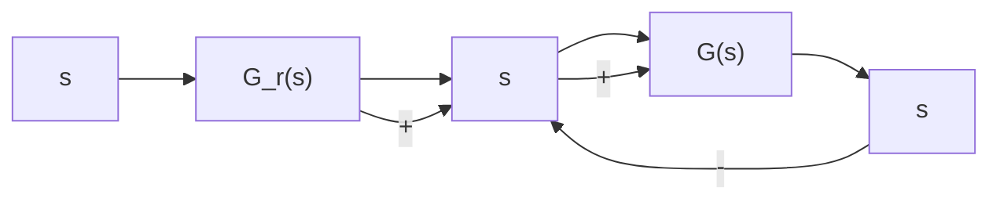

# 3. 按输入补偿的复合校正

设按输入补偿的复合控制系统如图 6-32 所示。图中， $G(s)$ 为反馈系统的开环传递函数，

$G_{r}(s)$ 为前馈补偿装置的传递函数。由图可知，系统的输出量为

flowchart

图 6-32 按输入补偿的复合控制系统

$$C (s) = [ E (s) + G _ {r} (s) R (s) ] G (s) \tag {6-47}$$

由于系统的误差

$$E (s) = R (s) - C (s) \tag {6-48}$$

所以可得

$$C (s) = \frac {[ 1 + G _ {r} (s) ] G (s)}{1 + G (s)} R (s) \tag {6-49}$$

如果选择前馈补偿装置的传递函数

$$G _ {r} (s) = \frac {1}{G (s)} \tag {6-50}$$

则式(6-49)变为

$$C (s) = R (s)$$

表明在式(6-50)成立的条件下,系统的输出量在任何时刻都可以完全无误地复现输入量,具有理想的时间响应特性。

为了说明前馈补偿装置能够完全消除误差的物理意义,将式(6-47)代入式(6-48),可得

$$E (s) = \frac {\left[ 1 - G _ {r} (s) G (s) \right]}{1 + G (s)} R (s) \tag {6-51}$$

上式表明，在式(6-50)成立的条件下，恒有 $E(s) = 0$ ；前馈补偿装置 $G_{r}(s)$ 的存在，相当于在系统中增加了一个输入信号 $G_{r}(s)R(s)$ ，其产生的误差信号与原输入信号 $R(s)$ 产生的误差信号相比，大小相等而方向相反。故式(6-50)称为对输入信号的误差全补偿条件。

由于 $G(s)$ 一般均具有比较复杂的形式，故全补偿条件(6-50)的物理实现相当困难。在工程实践中，大多采用满足跟踪精度要求的部分补偿条件，或者在对系统性能起主要影响的频段内实现近似全补偿，以使 $G_{r}(s)$ 的形式简单并易于物理实现。

为了便于分析按输入补偿的复合校正系统的误差和稳定性,需要引入等效开环传递函数的概念。由式(6-49)知,系统闭环传递函数为

$$\Phi (s) = \frac {C (s)}{R (s)} = \frac {[ 1 + G _ {r} (s) ] G (s)}{1 + G (s)} \tag {6-52}$$

定义等效开环传递函数

$$G _ {k} (s) = \frac {\Phi (s)}{1 - \Phi (s)} = \frac {[ 1 + G _ {r} (s) ] G (s)}{1 - G _ {r} (s) G (s)} \tag {6-53}$$

显然，式(6-52)和式(6-53)对于单位反馈复合控制系统才能成立。相应的误差传递函数为

$$\Phi_ {e} (s) = \frac {E (s)}{R (s)} = 1 - \Phi (s) = \frac {1 - G _ {r} (s) G (s)}{1 + G (s)} \tag {6-54}$$

上式亦可由式(6-51)直接导出。

在部分补偿情况下， $G_{r}(s) \neq 1/G(s)$ 。设反馈系统的开环传递函数

$$G (s) = \frac {K _ {v}}{s \left(a _ {n} s ^ {n - 1} + a _ {n - 1} s ^ {n - 2} + \cdots + a _ {2} s + a _ {1}\right)}$$

相应的闭环传递函数

$$\Phi (s) = \frac {K _ {v}}{s (a _ {n} s ^ {n - 1} + a _ {n - 1} s ^ {n - 2} + \cdots + a _ {2} s + a _ {1}) + K _ {v}} \tag {6-55}$$

显然,这是Ⅰ型系统,存在常值速度误差,且加速度误差为无穷大。

若取输入信号的一阶导数作为前馈补偿信号，即

$$G _ {r} (s) = \lambda_ {1} s$$

其中，常系数 $\lambda_{1}$ 表示前馈补偿信号的强度。此时，由式(6-52)得等效系统的闭环传递函数

$$\Phi (s) = \frac {K _ {v} \left(1 + \lambda_ {1} s\right)}{s \left(a _ {n} s ^ {n - 1} + a _ {n - 1} s ^ {n - 2} + \dots + a _ {2} s + a _ {1}\right) + K _ {v}} \tag {6-56}$$

根据式(6-54)，得等效系统的误差传递函数
