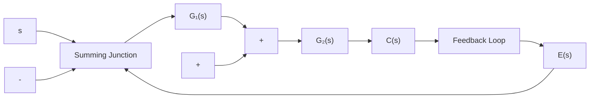

$$\Phi_ {e} (s) = \frac {a _ {n} s ^ {n} + a _ {n - 1} s ^ {n - 1} + \cdots + a _ {2} s ^ {2} + \left(a _ {1} - \lambda_ {1} K _ {v}\right) s}{s \left(a _ {n} s ^ {n - 1} + a _ {n - 1} s ^ {n - 2} + \dots + a _ {2} s + a _ {1}\right) + K _ {v}}$$

取 $\lambda_{1} = \frac{a_{1}}{K_{v}}$

可得

$$\Phi_ {e} (s) = \frac {s ^ {2} \left(a _ {n} s ^ {n - 2} + a _ {n - 1} s ^ {n - 3} + \cdots + a _ {2}\right)}{s \left(a _ {n} s ^ {n - 1} + a _ {n - 1} s ^ {n - 2} + \cdots + a _ {2} s + a _ {1}\right) + K _ {v}} \tag {6-57}$$

于是，等效开环传递函数

$$G _ {k} (s) = \frac {1 - \Phi_ {e} (s)}{\Phi_ {e} (s)} = \frac {a _ {1} s + K _ {v}}{s ^ {2} \left(a _ {n} s ^ {n - 2} + \cdots + a _ {2}\right)} \tag {6-58}$$

上式表明，引入 $G_{r}(s) = \lambda_{1}s$ 的前馈补偿装置，并使 $\lambda_1 = a_1 / K_v$ ，可以使复合控制系统等效为II型系统。此时，复合控制系统的速度误差为零，加速度误差为常值。利用式(6-57)，根据终值定理方法不难验证这一结论。

若取输入信号的一阶导数和二阶导数的线性组合作为前馈补偿信号，即

$$G _ {r} (s) = \lambda_ {2} s ^ {2} + \lambda_ {1} s$$

则等效系统的闭环传递函数

$$\Phi (s) = \frac {K _ {v} \left(1 + \lambda_ {1} s + \lambda_ {2} s ^ {2}\right)}{s \left(a _ {n} s ^ {n - 1} + a _ {n - 1} s ^ {n - 2} + \dots + a _ {2} s + a _ {1}\right) + K _ {v}} \tag {6-59}$$

等效系统的误差传递函数

$$\Phi_ {e} (s) = \frac {a _ {n} s ^ {n} + a _ {n - 1} s ^ {n - 1} + \cdots + \left(a _ {2} - \lambda_ {2} K _ {v}\right) s ^ {2} + \left(a _ {1} - \lambda_ {1} K _ {v}\right) s}{s \left(a _ {n} s ^ {n - 1} + a _ {n - 1} s ^ {n - 2} + \dots + a _ {2} s + a _ {1}\right) + K _ {v}}$$

取 $\lambda_{1} = \frac{a_{1}}{K_{v}},\quad \lambda_{2} = \frac{a_{2}}{K_{v}}$

可得

$$\Phi_ {e} (s) = \frac {s ^ {3} \left(a _ {n} s ^ {n - 3} + a _ {n - 1} s ^ {n - 4} + \cdots + a _ {3}\right)}{s \left(a _ {n} s ^ {n - 1} + a _ {n - 1} s ^ {n - 2} + \cdots + a _ {2} s + a _ {1}\right) + K _ {v}} \tag {6-60}$$

于是，等效开环传递函数

$$G _ {k} (s) = \frac {a _ {2} s ^ {2} + a _ {1} s + K _ {v}}{s ^ {3} \left(a _ {n} s ^ {n - 3} + a _ {n - 1} s ^ {n - 4} + \dots + a _ {3}\right)} \tag {6-61}$$

由式(6-60)及式(6-61)可见，引入 $G_{r}(s) = \lambda_{2}s^{2} + \lambda_{1}s$ 的前馈补偿装置，并使 $\lambda_1 = a_1 / K_v, \lambda_2 = a_2 / K_v$ ，可以使复合控制系统等效为III型系统。这时，复合控制系统的速度误差和加速度误差均为零，极大地提高了系统复现输入信号的能力和精度。

有时，前馈补偿信号不是加在系统的输入端，而是加在系统前向通路上某个环节的输入端，以简化误差全补偿条件，如图6-33所示。由图可知，复合控制系统的输出量

flowchart

图 6-33 按输入补偿的复合控制系统

$$C (s) = \frac {[ G _ {1} (s) + G _ {r} (s) ] G _ {2} (s)}{1 + G _ {1} (s) G _ {2} (s)} R (s)$$
