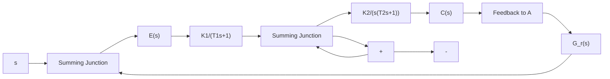

上式表明,若条件式(6-66)或式(6-67)成立,等效系统成为 III 型系统,其速度误差及加速度误差均为零。

比较式(6-59)与式(6-65)可以看出,当前馈装置的传递函数为式(6-64)形式时,复合控制系统的特征方程也同样增加了因子 $(Ts+1)$ ,从而使闭环系统增加了一个s=-1/T的极点。由于增加的闭环极点位于左半s平面,对系统的稳定性没有影响,但是对系统的动态性能有影响。在设计系统时,应注意选择无源网络的R和C的数值,除使T值满足式(6-67)外,还应使T值较小,从而附加闭环极点-1/T远离虚轴,对系统动态性能的影响甚微。

不难理解, $G_{r}(s)=\lambda_{1}s$ 的前馈补偿规律可直接用测速发电机实现。为了便于调整参数,测速发电机的输出端应跨接分压电位器。

例 6-9 设复合校正随动系统如图 6-35 所示。试选择前馈补偿方案和参数，使复合控制系统等效为 II 型或 III 型系统。

解 前馈补偿方案及其参数选择, 可按如下几步讨论:

flowchart

图 6-35 复合校正随动系统

1) 选择 $G_{r}(s) = \lambda_{1}s$ 。在图6-35中，令

$$G _ {1} (s) = \frac {K _ {1}}{T _ {1} s + 1}, \quad G _ {2} (s) = \frac {K _ {2}}{s (T _ {2} s + 1)}G (s) = G _ {1} (s) G _ {2} (s) = \frac {K _ {1} K _ {2}}{s [ T _ {1} T _ {2} s ^ {2} + (T _ {1} + T _ {2}) s + 1 ]}$$

易知：未补偿系统为I型系统，且 $a_3 = T_1T_2,a_2 = T_1 + T_2,a_1 = 1$ 。由式(6-62)得等效系统的误差传递函数

$$\Phi_ {e} (s) = \frac {T _ {1} T _ {2} s ^ {3} + (T _ {1} + T _ {2} - \lambda_ {1} K _ {2} T _ {1}) s ^ {2} + (1 - \lambda_ {1} K _ {2}) s}{s (T _ {1} s + 1) (T _ {2} s + 1) + K _ {1} K _ {2}}$$

显然，若选

$$\lambda_ {1} = \frac {1}{K _ {2}}$$

则复合控制系统等效为Ⅱ型系统，在斜坡函数输入时的稳态误差为零。实质上，取 $\lambda_{1}=1/K_{2}$ ，只

是一种部分补偿。

2）选择 $G_{r}(s) = \lambda_{2}s^{2} + \lambda_{1}s$ 。不难求得等效系统的闭环传递函数

$$\Phi (s) = \frac {K _ {1} K _ {2} + K _ {2} (\lambda_ {2} s ^ {2} + \lambda_ {1} s) (T _ {1} s + 1)}{s (T _ {1} s + 1) (T _ {2} s + 1) + K _ {1} K _ {2}}$$

以及等效误差传递函数

$$\Phi_ {e} (s) = \frac {(T _ {1} T _ {2} - K _ {2} T _ {1} \lambda_ {2}) s ^ {3} + (T _ {1} + T _ {2} - K _ {2} T _ {1} \lambda_ {1} - K _ {2} \lambda_ {2}) s ^ {2} + (1 - K _ {2} \lambda_ {1}) s}{s (T _ {1} s + 1) (T _ {2} s + 1) + K _ {1} K _ {2}}$$

若选 $\lambda_{1} = \frac{1}{K_{2}},\quad \lambda_{2} = \frac{T_{2}}{K_{2}}$

可使 $\Phi_{e}(s) \equiv 0$ 。此时，由于满足误差全补偿条件 $G_{r}(s) = 1 / G_{2}(s)$ ，故复合校正系统对任何形式的输入信号均不产生误差。但是

$$G _ {r} (s) = \frac {s (T _ {2} s + 1)}{K _ {2}}$$

的形式是难以准确实现的，只能在对系统性能起主要影响的频段范围内近似实现。

3）选择 $G_{r}(s) = \frac{\lambda_{2}s^{2} + \lambda_{1}s}{Ts + 1}$ 。不难证明，当取

$$\lambda_ {1} = \frac {1}{K _ {2}}, \quad \lambda_ {2} = \frac {T _ {2} + T}{K _ {2}}$$

复合校正系统等效为 III 型系统，在加速度函数输入作用下，系统的稳态误差为零。在物理装置上，可考虑采用测速发电机与无源网络的组合线路近似实现上述补偿方案。
