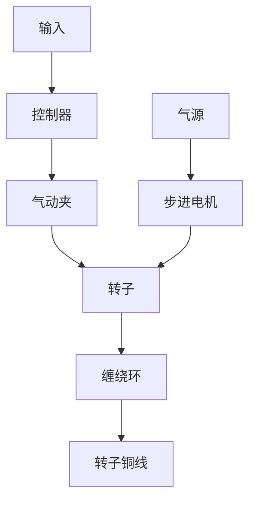
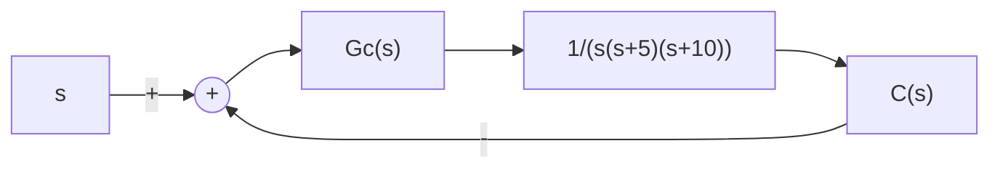

# 例 6-10 转子绕线机控制系统

设转子绕线机控制系统如图 6-36(a) 所示, 图 6-36(b) 为相应的结构图。绕线机用直流电机来缠绕铜线, 能快速准确地绕线, 并使线圈连贯坚固。采用自动绕线机后, 操作人员只需从事插入空的转子、按下启动按钮和取下绕好线的转子等简单操作。


<details>
<summary>flowchart</summary>


</details>

(a) 转子绕线机控制系统


<details>
<summary>flowchart</summary>


</details>

(b) 结构图  
图 6-36 转子绕线机

控制器 $G_{c}(s)$ 设计的具体要求是：

1）系统对斜坡输入响应的稳态误差小于 $10\%$ ，静态速度误差系数 $K_{v} = 10$   
2）系统对阶跃输入的超调量在10%左右；

3) 按 $\Delta=2\%$ 要求的系统调节时间为 3s 左右。

解 由图 6-36(b) 可见, 系统为 I 型系统, 在单位斜坡输入作用下, 稳态误差

$$e _ {s} (\infty) = \frac {1}{K _ {v}}$$

式中 $K_{v} = \lim_{s\to 0}\frac{G_{c}(s)}{50}$

$G_{c}(s)$ 为待设计的控制器(校正网络)。

首先考虑采用简单的增益放大器, $G_{c}(s)=K_{1}$ ，则系统的速度误差

$$e _ {s} (\infty) = \frac {5 0}{K _ {1}}$$

可见,为了提高系统的稳态精度,必须采用高增益,但过高的 $K_{1}$ 对系统的稳定性和动态性能都会产生不利的影响。图6-37给出了不同 $K_{1}$ 值下的系统响应及相应的MATLAB文本。从中可见,当 $K_{1} = 500$ 时,系统的 $K_{v} = 10, e_{s}(\infty) = 10\%$ ,刚好满足设计要求,但系统对阶跃输入的 $\sigma \% = 70\%, t_s = 8s$ ,远大于设计指标值。因此,必须采用较为复杂的校正网络。


<details>
<summary>line</summary>

| Time/sec | K₁=50 | K₁=1/500 |
| --- | --- | --- |
| 0.0 | 0.0 | 0.0 |
| 0.5 | 0.2 | 1.7 |
| 1.0 | 0.6 | 1.3 |
| 1.5 | 0.8 | 1.4 |
| 2.0 | 0.9 | 1.0 |
| 2.5 | 1.0 | 1.2 |
| 3.0 | 1.0 | 1.0 |
| 3.5 | 1.0 | 1.1 |
| 4.0 | 1.0 | 1.0 |
| 4.5 | 1.0 | 1.0 |
| 5.0 | 1.0 | 1.0 |
</details>

(a) 简单增益控制器的瞬态响应

```matlab
K1=[50,100,200,500]; %针对增益K的4个不同取值，分别计算系统的阶跃响应
num=[1];den=[1,15,50,0];
t=0:0.01:5;
for i=1:4
    G0=tf(K1(i)*num,den);
    G=feedback(G0,1); %闭环传递函数
    [y,x]=step(G,t);
    C(:,i)=y; %保存阶跃响应的计算结果
end
plot(t,C(:,1),'-',t,C(:,2),':',t,C(:,3),'---',t,C(:,4),'-');grid
(b) MATLAB文本
```  
图 6-37 简单增益控制器校正(MATLAB)

由于超前校正网络能改善系统的动态响应性能,因而尝试选用如下超前校正网络:

$$G _ {c} (s) = \frac {K _ {1} (s + z)}{(s + p)} = \frac {K _ {1} (s + 1 / a T)}{s + 1 / T}$$

式中， $|z| < |p|$ ，且 $z = \frac{1}{aT}, p = \frac{1}{T}$ ，故 $p = az$ 。

系统校正后的开环传递函数为

$$G (s) = \frac {K _ {1} (s + z)}{s (s + 5) (s + 1 0) (s + p)}$$
