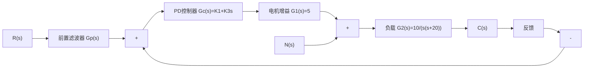

# 例 6-11 磁盘驱动读取系统(续)

当忽略电机磁场影响时, 具有 PD 控制器的磁盘驱动系统如图 6-44 所示。为了消除 PD 控制形成的零点因式 $(s+z)$ 对闭环动态性能的不利影响, 系统配置了前置滤波器 $G_{p}(s)$ 。要求设计 PD 控制器 $G_{c}(s)$ 和前置滤波器 $G_{p}(s)$ , 使系统成为最小节拍响应系统, 并满足以下设计指标:

1) 单位阶跃响应超调量 $\sigma\%<5\%$ ;  
2）单位阶跃响应调节时间 $t_{s}<50\mathrm{ms}(\Delta=2\%)$ ;  
3）单位阶跃扰动作用下的最大响应 $<5\times10^{-3}$ 。

flowchart

图 6-44 带有 PD 控制器的磁盘驱动器控制系统(二阶系统模型)

解 由图 6-44 知, 当不考虑 $G_{p}(s)$ 时, 系统开环传递函数

$$G (s) = G _ {c} (s) G _ {1} (s) G _ {2} (s) = \frac {5 0 (K _ {1} + K _ {3} s)}{s (s + 2 0)}$$

相应的闭环传递函数

$$\Phi (s) = \frac {G (s)}{1 + G (s)} = \frac {5 0 \left(K _ {1} + K _ {3} s\right)}{s ^ {2} + \left(2 0 + 5 0 K _ {3}\right) s + 5 0 K _ {1}}$$

由表 6-3 知,二阶最小节拍响应系统的标准化闭环传递函数为

$$\Phi (s) = \frac {\omega_ {n} ^ {2}}{s ^ {2} + \alpha \omega_ {n} s + \omega_ {n} ^ {2}}, \quad \alpha = 1. 8 2$$

标准化调节时间应为

$$\omega_ {n} t _ {s} = 4. 8 2$$

根据设计指标要求， $t_{s}<50ms$ ，应有 $\omega_{n}>96.4$ ，于是可取 $\omega_{n}=120$ ，其对应的调节时间

$$t _ {s} = \frac {4 . 8 2}{\omega_ {n}} = 4 0. 2 \mathrm{ms} < 5 0 \mathrm{ms} (\Delta = 2 \%)$$

可以满足设计要求。这样，二阶最小节拍系统的标准化闭环传递函数为

$$\Phi (s) = \frac {1 4 4 0 0}{s ^ {2} + 2 1 8 . 4 s + 1 4 4 0 0}$$

令实际闭环传递函数与标准化闭环传递函数分母相等，有

$$2 1 8. 4 = 2 0 + 5 0 K _ {3},$$

line

| Time | Amplitude |
| --- | --- |
| 0.00 | 0.0 |
| 0.01 | 1.0 |
| 0.02 | 1.1 |
| 0.03 | 1.05 |
| 0.04 | 1.02 |
| 0.05 | 1.01 |
| 0.06 | 1.0 |

图 6-45 无前置滤波器时系统的时间响应(MATLAB)

$$1 4 4 0 0 = 5 0 K _ {1}$$

解得 $K_{1}=288, K_{3}=3.968$ 。于是，所需的 PD 控制器为

$$G _ {c} (s) = K _ {1} + K _ {3} s = 3. 9 6 8 (s + 7 2. 5 8)$$

为了消除 PD 控制器新增闭环零点 $(s+72.58)$ 的不利影响, 将前置滤波器取为

$$G _ {p} (s) = \frac {7 2 . 5 8}{s + 7 2 . 5 8}$$

最后，对所设计的系统进行仿真测试。无前置滤波器时单位阶跃输入响应，如图6-45所示，仿真表明，闭环零点可以提升系统的上升时间，但恶化了系统的超调量；而有前置滤波器时系统的单位阶跃时间响应，如图6-46(a)所示，其动态性能大为改

善，超调量 $\sigma \% = 0.1\%$ ，调节时间 $t_s = 40\mathrm{ms}(\Delta = 2\%)$ ；同时，图6-46(b)所示的有前置滤波器时系统的单位阶跃扰动响应，表明系统能有效抑制扰动的影响，最大扰动响应值为 $6.9\times 10^{-4}$ 。从而全部满足设计指标要求。

MATLAB 文本：

$$\mathrm{K} 1 = 2 8 8; \mathrm{K} 3 = 3. 9 6 8;$$

$\mathrm{Gc} = \mathrm{tf}([K3, K1], 1)$ ; %PD 控制器的传递函数

$$\mathrm{G} 1 = 5;$$
