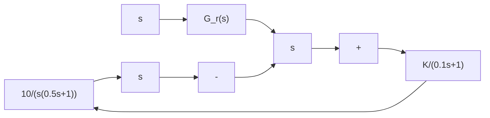
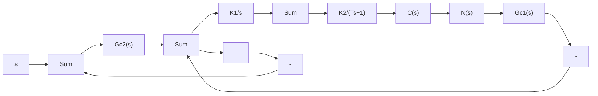

# 6-8 设单位反馈系统的开环传递函数

$$G _ {0} (s) = \frac {K}{s (0 . 1 s + 1) (0 . 0 1 s + 1)}$$

试设计串联校正装置,使系统特性满足下列指标:

(1) 静态速度误差系数 $K_{v} \geqslant 250 s^{-1}$ ;  
(2) 截止频率 $\omega_{c} \geqslant 30 rad/s$ ;   
(3) 相角裕度 $\gamma(\omega_{c})\geqslant45^{\circ}$

6-9 设复合校正控制系统如图 6-49 所示。若要求闭环回路过阻尼，且系统在斜坡输入作用下的稳态误差为零，试确定 K 值及前馈补偿装置 $G_{r}(s)$ 。

6-10 设复合校正控制系统如图 6-50 所示, 其中 $N(s)$ 为可量测扰动, $K_{1}$ 、 $K_{2}$ 、T 均为正常数。若要求系统输出 $C(s)$ 完全不受 $N(s)$ 的影响, 且跟踪阶跃指令的误差为零, 试确定前馈补偿装置 $G_{c1}(s)$ 和串联校正装置 $G_{c2}(s)$ 。

line

| ω | L(ω) |
| --- | --- |
| 0.1 | 0.1 |
| 1.0 | -20dB/dec |
| 10 | 0dB/dec |
| 100 | 0dB/dec |

line

| ω | L(ω) |
| --- | --- |
| 10 | 0 |
| 100 | 0dB/dec |

line

| ω | L(ω) |
| --- | --- |
| 0.1 | 0.0 |
| 1.0 | -20dB/dec |
| 2.0 | -20dB/dec |
| 10 | 0.0 |
| 40 | 0.0 |
| 100 | 0.0 |

图 6-48 推荐的校正网络特性  

flowchart

图 6-49 复合控制系统

flowchart

图 6-50 复合控制系统

6-11 设复合控制系统如图 6-51 所示。图中 $G_{n}(s)$ 为前馈补偿装置的传递函数， $G_{c}(s)=K_{t}s$ 为测速发电机的传递函数， $G_{1}(s)$ 和 $G_{2}(s)$ 为前向通路环节的传递函数， $N(s)$ 为可量测扰动。如果

$$G _ {1} (s) = K _ {1}, \quad G _ {2} (s) = \frac {1}{s ^ {2}}$$

flowchart

