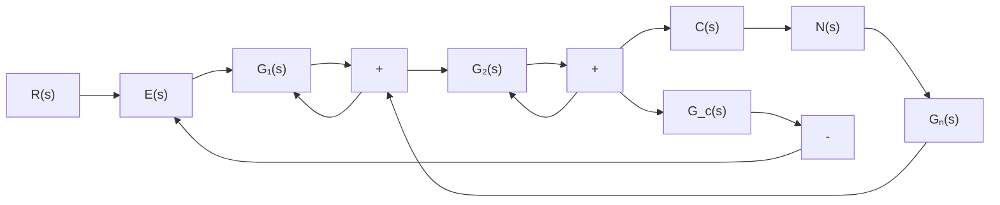
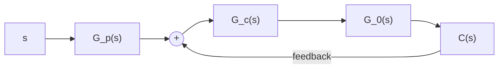
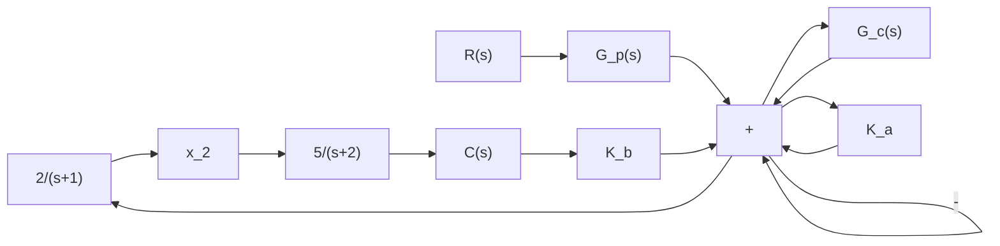

图 6-51 复合控制系统

试确定 $G_{n}(s), G_{c}(s)$ 和 $K_{1}$ ，使系统输出量完全不受可量测扰动的影响，且单位阶跃响应的超调量 $\sigma \% = 25\%$ ，峰值时间 $t_{p} = 2s$ 。

6-12 设复合控制系统如图 6-33 所示。图中

$$G _ {1} (s) = K _ {1}, \quad K _ {1} = 2G _ {2} (s) = \frac {K _ {2}}{s (s + 2 0 \zeta)}, \qquad K _ {2} = 5 0, \zeta = 0. 5G _ {r} (s) = \frac {\lambda_ {2} s ^ {2} + \lambda_ {1} s}{T s + 1}, \quad T = 0. 2$$

试确定 $\lambda_{1}$ 和 $\lambda_{2}$ 的数值,使系统等效为 III 型系统,并讨论寄生因式 $(Ts+1)$ 对系统稳定性和动态性能的影响。

text_image

弹簧
拉力滑轮
弹性皮带
滑轮A
滑轮B

图 6-52 组合驱动装置

6-13 设组合驱动装置如图 6-52 所示。该装置由两个工作滑轮 A 和 B 组成，通过弹性皮带连在一起，挂在弹簧上的第三个拉力滑轮可以将皮带拉紧，而弹簧运动可以视为无摩擦的运动。在组合驱动装置中，主滑轮 A 由直流电机驱动，滑轮 A 和 B 上都装有测速计，其输出电压与滑轮的转速成正比，利用测得的速度信号，可以估计每个滑轮的转角。

设组合驱动装置的转速控制系统如图 6-53 所示, 其中被控对象为组合驱动装置, 其传递函数

$$G _ {0} (s) = \frac {1 0}{(s + 6) ^ {2}}$$

$G_{c}(s)$ 为PI控制器，其传递函数

$$G _ {c} (s) = K _ {1} + \frac {K _ {2}}{s}$$

$G_{p}(s)$ 为前置滤波器。要求设计 $G_{c}(s)$ 和 $G_{p}(s)$ ，使系统具有最小节拍响应，且调节时间 $t_{s} \leqslant 1\mathrm{s}(\Delta = 2\%)$ 。

flowchart

图 6-53 组合驱动装置转速控制系统

6-14 设有前置滤波器的鲁棒控制系统如图 6-54 所示, 其中被控对象

$$G _ {0} (s) = \frac {1 0}{(s + 1) (s + 2)}$$

flowchart

图 6-54 具有前置滤波器的鲁棒控制系统

PID 控制器

$$G _ {c} (s) = \frac {K _ {3} s ^ {2} + K _ {1} s + K _ {2}}{s}$$

$G_{p}(s)$ 为前置滤波器。设计要求：
