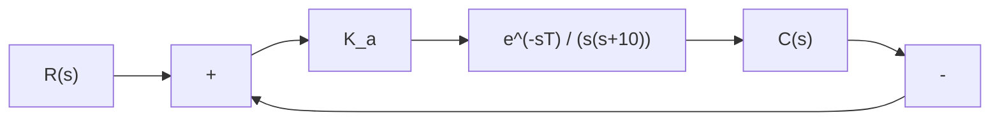

(1) 当 $K_{a}=10, K_{b}=0$ 时，设计 $G_{c}(s)$ 和 $G_{p}(s)$ ，使系统具有最小节拍响应，即系统在单位阶跃输入作用下， $e_{s}(\infty)=0, \sigma\% \leqslant 2\%, t_{s} \leqslant 1 \mathrm{s} (\Delta=2\%)$ ;  
(2) 若 $G_{0}(s)$ 的两个极点发生 ±50% 范围摄动，在最坏情况下，被控对象变为

$$G _ {0} (s) = \frac {1 0}{(s + 0 . 5) (s + 1)}$$

试用(1)中的设计结果,对系统性能进行考核,以检验系统的鲁棒性。

6-15 NASA 的宇航员可以在航天飞机中通过控制机械手将卫星回收到航天飞机的货舱中, 如图 6-55(a) 所示。图中显示了宇航员站在机械臂上工作。该卫星回收系统结构图如图 6-55(b) 所示。要求:

(1) 当 T=0.1s 时, 确定 $K_{a}$ 的取值, 使系统的相角裕度 $\gamma=50^{\circ}$ ;  
(2) 当 T=0.5s 时, 仍采用(1)中确定的 $K_{a}$ , 求此时系统的相角裕度 $\gamma_{1}$ ;  
(3) 当 T=0.5s 时, 若要求 $\gamma_{1}=50^{\circ}$ , 试问 $K_{a}$ 值应如何改变?

natural_image

Black-and-white photo of a vehicle in motion with visible exhaust plume and no text or symbols

(a)

flowchart

(b)   
图 6-55 卫星回收控制系统

6-16 已知汽车点火系统中有一个单位负反馈子系统, 其开环传递函数为 $G_{c}(s)G_{0}(s)$ , 其中

$$G _ {0} (s) = \frac {1 0}{s (s + 1 0)}, \quad G _ {c} (s) = K _ {1} + \frac {K _ {2}}{s}$$

若已知 $K_{2}/K_{1}=0.5$ ，试确定 $K_{1}$ 和 $K_{2}$ 的取值，使系统主导极点的阻尼比 $\zeta=0.707$ ，而且单位阶跃响应的调节时间 $t_{s}\leqslant2\mathrm{s}(\Delta=5\%)$ 。

6-17 在核工业中,远程机器人主要用来回收和处理核废料,同时也用于核反应堆的监控,清除放射性污染和处理意外事故等。图 6-56 所示为核工厂的遥控机器人示意图,其构成的远程监控系统可以完成某些特定操作的监测任务。若系统的开环传递函数为

$$G _ {0} (s) = \frac {K _ {a} \mathrm{e} ^ {- s T}}{(s + 1) (s + 3)}$$

要求：

(1) 当 $T = 0.5\mathrm{s}$ 时, 确定 $K_{a}$ 的合适取值, 使系统阶跃响应的超调量小于 $30\%$ , 并计算所得系统的稳态误差;

(2) 设计校正网络

$$G _ {c} (s) = \frac {s + 2}{s + b}$$

以改进(1)中所得系统的性能,使系统的稳态误差小于12%。

text_image

操作器/手臂
监视摄像机
三维摄像机
通信

图 6-56 核电厂的遥控机器人

6-18 MANUTEC 机器人具有很大的惯性和较长的手臂,其实物如图 6-57(a) 所示。机械臂的动力学特性可以表示为

text_image

机械臂
关节

(a) MANUTEC机器人

flowchart

