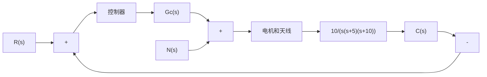
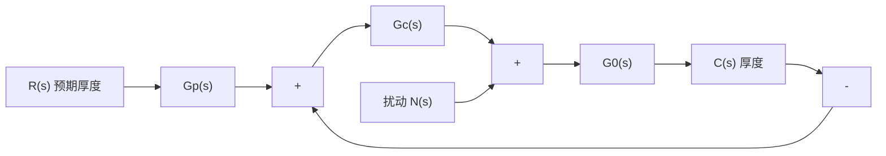

flowchart

(b) 结构图  
图 6-60 天线指向控制系统

框图如图 6-61(b) 所示, 其中

$$G _ {0} (s) = \frac {1}{s \left(s ^ {2} + 4 s + 5\right)}$$

而 $G_{c}(s)$ 为具有两个相同实零点的 PID 控制器。要求：

(1) 选择 PID 控制器的零点和增益, 使闭环系统有两对相等的特征根;  
(2) 考察(1)中得到的闭环系统,给出不考虑前置滤波器 $G_{p}(s)$ 与配置适当 $G_{p}(s)$ 时,系统的单位阶跃响应;  
(3) 当 $R(s)=0, N(s)=1/s$ 时，计算系统对单位阶跃扰动的响应。

flowchart

(a)   

flowchart

(b)   
图 6-61 热轧机控制系统
