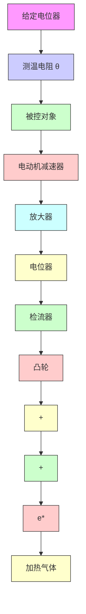

# 1. 采样控制系统

一般说来,采样系统是对来自传感器的连续信息在某些规定的时间瞬时上取值。例如,控制系统中的误差信号可以是断续形式的脉冲信号,而相邻两个脉冲之间的误差信息,系统并没有收到。如果在有规律的间隔上,系统取到了离散信息,则这种采样称为周期采样;反之,如果信息之间的间隔是时变的,或随机的,则称为非周期采样,或随机采样。本章仅讨论等周期采样。在这一假定下,如果系统中有几个采样器,则它们应该是同步等周期的。

在现代控制技术中,采样系统有许多实际的应用。例如,雷达跟踪系统,其输入信号只能为脉冲序列形式;又如分时系统,其数据传输线在几个系统中按时间分配,以降低信息传输费用。在工业过程控制中,采样系统也有许多成功的应用。

例 7-1 图 7-1 是炉温采样控制系统原理图。其工作原理如下：

当炉温 $\theta$ 偏离给定值时，测温电阻的阻值发生变化，使电桥失去平衡，这时检流计指针发生偏转，其偏角为 $s$ 。检流计是一个高灵敏度的元件，不允许在指针与电位器之间有摩擦力，故由一套专门的同步电动机通过减速器带动凸轮运转，使检流计指针周期性地上下运动，每隔 $T$ 秒与电位器接触一次，每次接触时间为 $\tau$ 。其中， $T$ 称为采样周期， $\tau$ 称为采样持续时间。当炉温连续变化时，电位器的输出是一串宽度为 $\tau$ 的脉冲电压信号 $e_{\tau}^{*}(t)$ ，如图7-2(a)所示。 $^{*}$ 经放大器、电动机及减速器去控制阀门开度 $\varphi$ ，以改变加热气体的进气量，使炉温趋于给定值。炉温的给定值，由给定电位器给出。

在炉温控制过程中,如果采用连续控制方式,则无法解决控制精度与动态性能之间的矛盾。

flowchart

图 7-1 炉温采样控制系统原理图

bar

| Time (t) | e^r_t(t) |
| --- | --- |
| 0 | High |
| T | High |
| 2T | Medium |
| 3T | Low |
| 4T | Low |

(a)

bar

| Time | e*(t) |
| --- | --- |
| 0 | High |
| T | High |
| 2T | Medium |
| 3T | Low |
| 4T | Low |

(b)   
图 7-2 电位器的输出电压
