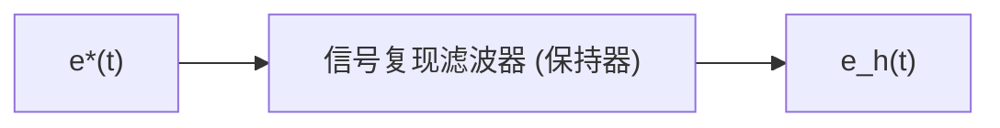
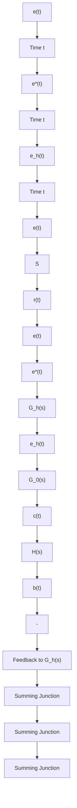

# (2) 采样系统的典型结构图

根据采样器在系统中所处的位置不同,可以构成各种采样系统。如果采样器位于系统闭合回路之外,或者系统本身不存在闭合回路,则称为开环采样系统;如果采样器位于系统闭合回路之内,则称为闭环采样系统。在各种采样控制系统中,用得最多的是误差采样控制的闭环采样系统,其典型结构图如图7-4所示。图中，S 为理想采样开关，其采样瞬时的脉冲幅值，等于相应采样瞬时误差信号 $e(t)$ 的幅值，且采样持续时间 $\tau$ 趋于零； $G_{h}(s)$ 为保持器的传递函数； $G_{0}(s)$ 为被控对象的传递函数； $H(s)$ 为测量变送反馈元件的传递函数。

flowchart

图 7-3 保持器的输入与输出信号

flowchart

图 7-4 采样系统典型结构图

由图 7-4 可见, 采样开关 S 的输出 $e^{*}(t)$ 的幅值, 与其输入 $e(t)$ 的幅值之间存在线性关系。

当采样开关和系统其余部分的传递函数都具有线性特性时,这样的系统就称为线性采样系统。
