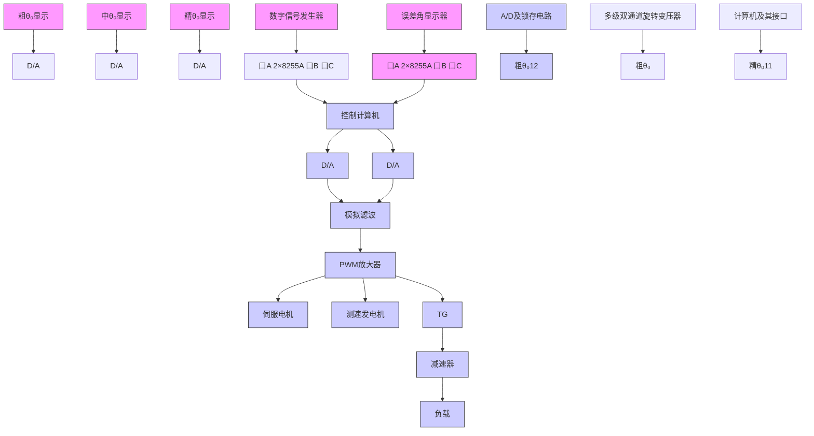

# 2. 数字控制系统

数字控制系统是一种以数字计算机为控制器去控制具有连续工作状态的被控对象的闭环控制系统。因此，数字控制系统包括工作于离散状态下的数字计算机和工作于连续状态下的被控对象两大部分。由于数字控制系统具有一系列的优越性，所以在军事、航空及工业过程控制中，得到了广泛的应用。

例 7-2 图 7-5 是小口径高炮高精度数字伺服系统原理图。

flowchart

图 7-5 小口径高炮高精度伺服系统

现代的高炮伺服系统，已由数字系统模式取代了原来模拟系统的模式，使系统获得了高速、高精度、无超调的特性，其性能大大超过了原有的高炮伺服系统。如美国多管火炮反导系统“密集阵”、“守门员”等，均采用了数字伺服系统。

本例系统采用 MCS-96 系列单片机作为数字控制器，并结合 PWM(脉宽调制)直流伺服系统形成数字控制系统，具有低速性能好、稳态精度高、快速响应性好、抗干扰能力强等特点。整个系统主要由控制计算机、被控对象和位置反馈三部分组成。控制计算机以 16 位单片机 MCS-96 为主体，按最小系统原则设计，具有 3 个输入接口和 5 个输出接口。

数字信号发生器给出的 16 位数字输入信号 $\theta_{i}$ 经两片 8255A 的口 A 进入控制计算机, 系统输出角 $\theta_{0}$ (模拟量) 经 110XFS1/32 多极双通道旋转变压器和 $2 \times 12$ XSZ741 A/D 变换器及其锁存电路完成绝对式轴角编码的任务, 将输出角模拟量 $\theta_{0}$ 转换成二进制数码粗、精各 12 位, 该数码经锁存后, 取粗 12 位、精 11 位由 8255A 的口 B 和口 C 进入控制计算机。经计算机软件运算, 将精、粗合并, 得到 16 位数字量的系统输出角 $\theta_{0}$ 。

控制计算机的 5 个输出接口分别为主控输出口、前馈输出口和 3 个误差角 $\theta_{e} = \theta_{i} - \theta_{0}$ 显示口。主控输出口由 12 位 D/A 转换芯片 DAC1210 等组成，其中包含与系统误差角 $\theta_{e}$ 及其一阶差分 $\Delta \theta_{e}$ 成正比的信号，同时也包含与系统输入角 $\theta_{i}$ 的一阶差分 $\Delta \theta_{i}$ 成正比的复合控制信号，从而构成系统的模拟量主控信号，通过 PWM 放大器，驱动伺服电机，带动减速器与小口径高炮，使

其输出转角 $\theta_{0}$ 跟踪数字指令 $\theta_{i}$ 。
