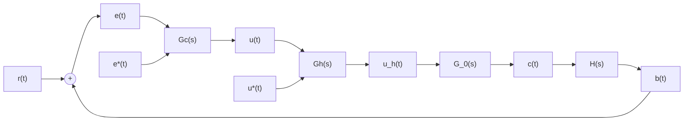

# 3. 离散控制系统的特点

采样和数控技术，在自动控制领域中得到了广泛的应用，其主要原因是采样系统，特别是数

flowchart

图 7-9 数字控制系统典型结构图

字控制系统较之相应的连续系统具有一系列的特点：

1) 由数字计算机构成的数字校正装置, 效果比连续式校正装置好, 且由软件实现的控制规律易于改变, 控制灵活。  
2）采样信号，特别是数字信号的传递可以有效地抑制噪声，从而提高了系统的抗扰能力。  
3）允许采用高灵敏度的控制元件，以提高系统的控制精度。  
4）用一台计算机分时控制若干个系统，提高了设备的利用率，经济性好。  
5) 对于具有传输延迟,特别是大延迟的控制系统,可以引入采样的方式稳定。
