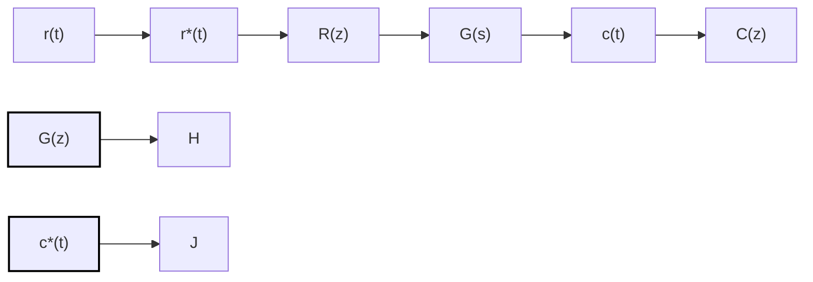
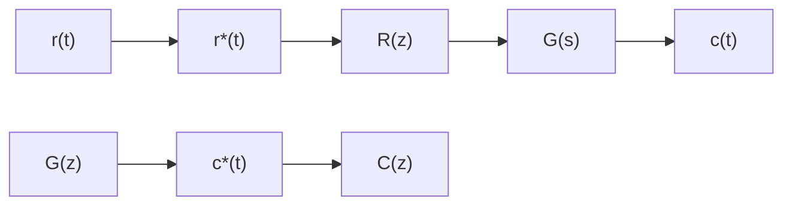

# (1) 脉冲传递函数定义

flowchart

图 7-21 开环离散系统

众所周知，利用传递函数研究线性连续系统的特性，有公认方便之处。对于线性连续系统，传递函数定义为在零初始条件下，输出量的拉氏变换与输入量的拉氏变换之比。对于线性离散系统，脉冲传递函数的定义与线性连续系统传递函数的定义类似。

设开环离散系统如图7-21所示，如果系统的初始条件为零，输入信号为 $r(t)$ ，采样后 $r^{*}(t)$ 的 $z$ 变换函数为 $R(z)$ ，系统连续部分的输出为 $c(t)$ ，采样后 $c^{*}(t)$ 的 $z$ 变换函数为 $C(z)$ ，则线性定常离散系统的脉冲传递函数定义为系统输出采样信号的 $z$ 变换与输入采样信号的 $z$ 变换之比，记为

$$G (z) = \frac {C (z)}{R (z)} = \frac {\sum_ {n = 0} ^ {\infty} c (n T) z ^ {- n}}{\sum_ {n = 0} ^ {\infty} r (n T) z ^ {- n}} \tag {7-51}$$

所谓零初始条件,是指在 t<0 时,输入脉冲序列各采样值 $r(-T)$ , $r(-2T)$ , …以及输出脉冲序列各采样值 $c(-T)$ , $c(-2T)$ , …均为零。

式(7-51)表明,如果已知 $R(z)$ 和 $G(z)$ , 则在零初始条件下, 线性定常离散系统的输出采样信号为

$$c ^ {*} (t) = \mathscr {L} ^ {- 1} [ C (z) ] = \mathscr {L} [ G (z) R (z) ]$$

由于 $R(z)$ 是已知的，因此求 $c^*(t)$ 的关键在于求出系统的脉冲传递函数 $G(z)$ 。

然而，对大多数实际系统来说，输出往往是连续信号 $c(t)$ ，而不是采样信号 $c^*(t)$ ，如图7-22所示。此时，可以在系统输出端虚设一个理想采样开关，如图中虚线所示，它与输入采样开关同步工作，并具有相同的采样周期。如果系统的实际输出 $c(t)$ 比较平滑，且采样频率较

flowchart

图 7-22 实际开环离散系统

高, 则可用 $c^*(t)$ 近似描述 $c(t)$ 。必须指出, 虚设的采样开关是不存在的, 它只表明了脉冲传递函数所能描述的, 只是输出连续函数 $c(t)$ 在采样时刻上的离散值 $c^*(t)$ 。
