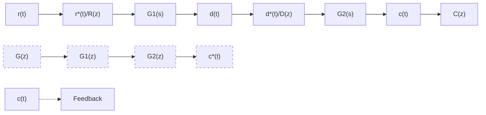
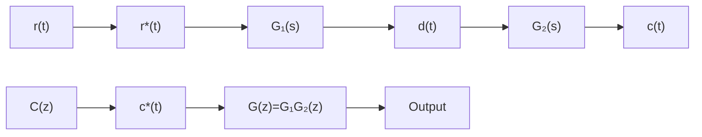

# (2) 有串联环节时的开环系统脉冲传递函数

如果开环离散系统由两个串联环节构成,则开环系统脉冲传递函数的求法与连续系统情况不完全相同。这是因为在两个环节串联时,有两种不同的情况。

1) 串联环节之间有采样开关。设开环离散系统如图7-23(a)所示，在两个串联连续环节 $G_{1}(s)$ 和 $G_{2}(s)$ 之间，有理想采样开关隔开。根据脉冲传递函数定义，由图7-23(a)可得

$$D (z) = G _ {1} (z) R (z), \quad C (z) = G _ {2} (z) D (z)$$

其中， $G_{1}(z)$ 和 $G_{2}(z)$ 分别为 $G_{1}(s)$ 和 $G_{2}(s)$ 的脉冲传递函数。于是有

$$C (z) = G _ {2} (z) G _ {1} (z) R (z)$$

因此，开环系统脉冲传递函数

$$G (z) = \frac {C (z)}{R (z)} = G _ {1} (z) G _ {2} (z) \tag {7-60}$$

式(7-60)表明,有理想采样开关隔开的两个线性连续环节串联时的脉冲传递函数,等于这两个环节各自的脉冲传递函数之积。这一结论,可以推广到类似的 n 个环节相串联时的情况。

2) 串联环节之间无采样开关。设开环离散系统如图 7-23(b) 所示，在两个串联连续环节 $G_{1}(s)$ 和 $G_{2}(s)$ 之间，没有理想采样开关隔开。显然，系统连续信号的拉氏变换为

$$C (s) = G _ {1} (s) G _ {2} (s) R ^ {*} (s)$$

式中， $R^{*}(s)$ 为输入采样信号 $r^{\ast}(t)$ 的拉氏变换，即

$$R ^ {*} (s) = \sum_ {n = 0} ^ {\infty} r (n T) \mathrm{e} ^ {- n s T}$$

对输出 $C(s)$ 离散化，并根据采样拉氏变换性质(7-59)，有

$$C ^ {*} (s) = \left[ G _ {1} (s) G _ {2} (s) R ^ {*} (s) \right] ^ {*} = \left[ G _ {1} (s) G _ {2} (s) \right] ^ {*} R ^ {*} (s) = G _ {1} G _ {2} ^ {*} (s) R ^ {*} (s) \tag {7-61}$$

flowchart

(a)

flowchart

(b)   
图 7-23 环节串联时的开环离散系统

式中 $G_{1}G_{2}^{*}(s) = [G_{1}(s)G_{2}(s)]^{*} = \frac{1}{T}\sum_{n = -\infty}^{\infty}G_{1}(s + \mathrm{j}\pi \omega_{s})G_{2}(s + \mathrm{j}\pi \omega_{s})$

通常

$$G _ {1} G _ {2} ^ {*} (s) \neq G _ {1} ^ {*} (s) G _ {2} ^ {*} (s)$$

对式(7-61)取 z 变换, 得

$$C (z) = G _ {1} G _ {2} (z) R (z)$$

式中， $G_{1}G_{2}(z)$ 定义为 $G_{1}(s)$ 和 $G_{2}(s)$ 乘积的 $z$ 变换。于是，开环系统脉冲传递函数

$$G (z) = \frac {C (z)}{R (z)} = G _ {1} G _ {2} (z) \tag {7-62}$$

式(7-62)表明,没有理想采样开关隔开的两个线性连续环节串联时的脉冲传递函数,等于这两个环节传递函数乘积后的相应 z 变换。这一结论也可以推广到类似的 n 个环节相串联时的情况。

显然，式(7-60)与式(7-62)是不等的，即
