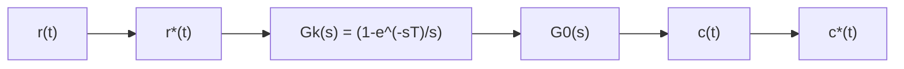
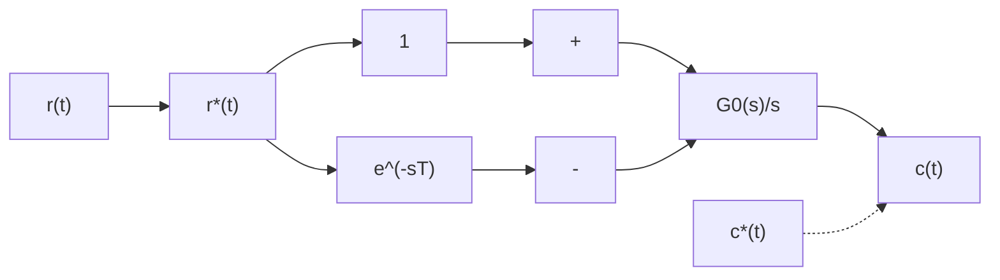

# (3) 有零阶保持器时的开环系统脉冲传递函数

设有零阶保持器的开环离散系统如图7-24(a)所示。图中， $G_{h}(s)$ 为零阶保持器传递函数， $G_0(s)$ 为连续部分传递函数，两个串联环节之间无同步采样开关隔离。由于 $G_{h}(s)$ 不是 $s$ 的有理分式函数，因此不便于用求串联环节脉冲传递函数的式(7-62)求出开环系统脉冲传递函数。如果将图7-24(a)变换为图7-24(b)所示的等效开环系统，则有零阶保持器时的开环系统脉冲传递函数的推导将是比较简单的。

flowchart

flowchart

图 7-24 有零阶保持器的开环离散系统

由图7-24(b)可得

$$C (s) = \Big [ \frac {G _ {0} (s)}{s} - \mathrm{e} ^ {- s T} \frac {G _ {0} (s)}{s} \Big ] R ^ {*} (s) \tag {7-63}$$

因为 $\mathrm{e}^{-sT}$ 为延迟一个采样周期的延迟环节，所以 $\mathrm{e}^{-sT}G_0(s) / s$ 对应的采样输出比 $G_{0}(s) / s$ 对应的采样输出延迟一个采样周期。对式(7-63)进行 $z$ 变换，根据实数位移定理及采样拉氏变换性质式(7-59)，可得

$$C (z) = \mathscr {L} \left[ \frac {G _ {0} (s)}{s} \right] R (z) - z ^ {- 1} \mathscr {L} \left[ \frac {G _ {0} (s)}{s} \right] R (z)$$

于是，有零阶保持器时，开环系统脉冲传递函数

$$G (z) = \frac {C (z)}{R (z)} = (1 - z ^ {- 1}) \mathcal {L} \left[ \frac {G _ {0} (s)}{s} \right] \tag {7-64}$$

当 $G_0(s)$ 为 $s$ 有理分式函数时，式(7-64)中的 $z$ 变换 $\mathcal{X}[G_0(s) / s]$ 也必然是 $z$ 的有理分式函数。

例 7-19 设离散系统如图 7-24(a) 所示, 已知

$$G _ {0} (s) = \frac {a}{s (s + a)}$$

试求系统的脉冲传递函数 $G(z)$ 。

解 因为

$$\frac {G _ {0} (s)}{s} = \frac {a}{s ^ {2} (s + a)} = \frac {1}{s ^ {2}} - \frac {1}{a} \left(\frac {1}{s} - \frac {1}{s + a}\right)$$

查 $z$ 变换表7-2，有

$$
\begin{array}{l} \mathcal {L} \left[ \frac {G _ {0} (s)}{s} \right] = \frac {T z}{(z - 1) ^ {2}} - \frac {1}{a} \left(\frac {z}{z - 1} - \frac {z}{z - e ^ {- a T}}\right) \\ = \frac {\frac {1}{a} z [ (\mathrm{e} ^ {- a T} + a T - 1) z + (1 - a T \mathrm{e} ^ {- a T} - \mathrm{e} ^ {- a T}) ]}{(z - 1) ^ {2} (z - \mathrm{e} ^ {- a T})} \\ \end{array}
$$

因此，有零阶保持器的开环系统脉冲传递函数

$$
\begin{array}{l} G (z) = (1 - z ^ {- 1}) \mathscr {L} \left[ \frac {G _ {0} (s)}{s} \right] \\ = \frac {\frac {1}{a} \left[ \left(\mathrm{e} ^ {- a T} + a T - 1\right) z + (1 - a T \mathrm{e} ^ {- a T} - \mathrm{e} ^ {- a T}) \right]}{(z - 1) (z - \mathrm{e} ^ {- a T})} \\ \end{array}
$$

现在, 把上述结果与例 7-17 所得结果作一比较。在例 7-17 中, 连续部分的传递函数与本例相同, 但是没有零阶保持器。比较两例的开环系统脉冲传递函数可知, 两者极点完全相同, 仅零点不同。所以说, 零阶保持器不影响离散系统脉冲传递函数的极点。
