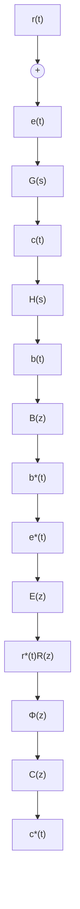
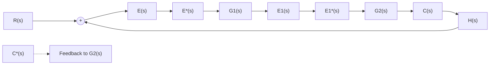

# 5. 闭环系统脉冲传递函数

由于采样器在闭环系统中可以有多种配置的可能性,因此闭环离散系统没有唯一的结构图形式。图7-25是一种比较常见的误差采样闭环离散系统结构图。图中,虚线所示的理想采样开关是为了便于分析而虚设的,输入采样信号 $r^{*}(t)$ 和反馈采样信号 $b^{*}(t)$ 事实上并不存在。图中所有理想采样开关都同步工作,采样周期为T。

由图 7-25 可见, 连续输出信号和误差信号的拉氏变换为

flowchart

图 7-25 闭环离散系统结构图

$$
\begin{array}{l} C (s) = G (s) E ^ {*} (s) \\ E (s) = R (s) - H (s) C (s) \\ \end{array}
$$

因此有

$$E (s) = R (s) - H (s) G (s) E ^ {*} (s)$$

于是，误差采样信号 $e^{*}(t)$ 的拉氏变换

$$E ^ {*} (s) = R ^ {*} (s) - H G ^ {*} (s) E ^ {*} (s)$$

整理得

$$E ^ {*} (s) = \frac {R ^ {*} (s)}{1 + H G ^ {*} (s)} \tag {7-65}$$

由于

$$C ^ {*} (s) = [ G (s) E ^ {*} (s) ] ^ {*} = G ^ {*} (s) E ^ {*} (s) = \frac {G ^ {*} (s)}{1 + H G ^ {*} (s)} R ^ {*} (s) \tag {7-66}$$

所以对式(7-65)及式(7-66)取 $z$ 变换，可得

$$E (z) = \frac {1}{1 + H G (z)} R (z) \tag {7-67}C (z) = \frac {G (z)}{1 + H G (z)} R (z) \tag {7-68}$$

根据式(7-67)，定义

$$\Phi_ {e} (z) = \frac {E (z)}{R (z)} = \frac {1}{1 + H G (z)} \tag {7-69}$$

为闭环离散系统对于输入量的误差脉冲传递函数。根据式(7-68)，定义

$$\Phi (z) = \frac {C (z)}{R (z)} = \frac {G (z)}{1 + H G (z)} \tag {7-70}$$

为闭环离散系统对于输入量的脉冲传递函数。

式(7-69)和式(7-70)是研究闭环离散系统时经常用到的两个闭环脉冲传递函数。与连续系统相类似，令 $\Phi(z)$ 或 $\Phi_{e}(z)$ 的分母多项式为零，便可得到闭环离散系统的特征方程

$$D (z) = 1 + G H (z) = 0 \tag {7-71}$$

式中， $GH(z)$ 为开环离散系统脉冲传递函数。

需要指出，闭环离散系统脉冲传递函数不能从 $\Phi (s)$ 和 $\Phi_{e}(s)$ 求 $z$ 变换得来，即

$$\Phi (z) \neq \mathscr {L} [ \Phi (s) ], \quad \Phi_ {e} (z) \neq \mathscr {L} [ \Phi_ {e} (s) ]$$

这种原因,也是由于采样器在闭环系统中有多种配置之故。

通过与上面类似的方法, 还可以推导出采样器为不同配置形式的其他闭环系统的脉冲传递函数。但是, 只要误差信号 $e(t)$ 处没有采样开关, 输入采样信号 $r^{*}(t)$ (包括虚构的 $r^{*}(t)$ ) 便不存在, 此时不可能求出闭环离散系统对于输入量的脉冲传递函数, 而只能求出输出采样信号的 $z$ 变换函数 $C(z)$ 。

例 7-20 设闭环离散系统结构图如图 7-26 所示, 试证其闭环脉冲传递函数为

$$\Phi (z) = \frac {G _ {1} (z) G _ {2} (z)}{1 + G _ {1} (z) H G _ {2} (z)}$$

flowchart

图 7-26 闭环离散系统
