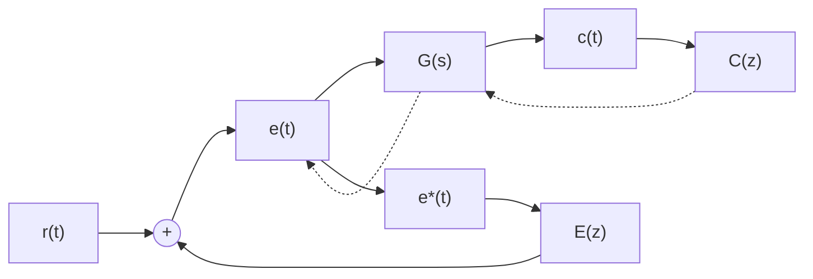

# 5. 离散系统的稳态误差

在连续系统中,稳态误差的计算可以利用两种方法进行:一种是建立在拉氏变换终值定理基础上的计算方法,可以求出系统的稳态误差;另一种是从系统误差传递函数出发的动态误差系数法,可以求出系统动态误差的稳态分量。这两种计算稳态误差的方法,在一定条件下都可以推广到离散系统。

由于离散系统没有唯一的典型结构图形式,所以误差脉冲传递函数 $\Phi_{e}(z)$ 也给不出一般的计算公式。离散系统的稳态误差需要针对不同形式的离散系统来求取。这里仅介绍利用 z 变换的终值定理方法，求取误差采样的离散系统在采样瞬时的稳态误差。

flowchart

图 7-38 单位反馈离散系统

设单位反馈误差采样系统如图 7-38 所示, 其中 $G(s)$ 为连续部分的传递函数, $e(t)$ 为系统连续误

差信号, $e^{*}(t)$ 为系统采样误差信号,其z变换函数为

$$E (z) = R (z) - C (z) = [ 1 - \Phi (z) ] R (z) = \Phi_ {e} (z) R (z)$$

其中 $\Phi_{e}(z) = \frac{E(z)}{R(z)} = \frac{1}{1 + G(z)}$

为系统误差脉冲传递函数。

如果 $\Phi_{e}(z)$ 的极点全部位于 $z$ 平面上的单位圆内，即若离散系统是稳定的，则可用 $z$ 变换的终值定理求出采样瞬时的稳态误差

$$e _ {s} (\infty) = \lim _ {t \rightarrow \infty} e ^ {*} (t) = \lim _ {z \rightarrow 1} \left(1 - z ^ {- 1}\right) E (z) = \lim _ {z \rightarrow 1} \frac {(z - 1) R (z)}{z [ 1 + G (z) ]} \tag {7-78}$$

上式表明,线性定常离散系统的稳态误差,不但与系统本身的结构和参数有关,而且与输入序列的形式及幅值有关。除此以外,由于 $G(z)$ 还与采样周期T有关,以及多数的典型输入 $R(z)$ 也与T有关,因此离散系统的稳态误差数值与采样周期的选取也有关。

例 7-27 设离散系统如图 7-38 所示, 其中 $G(s)=1/s(0.1s+1)$ , T=0.1s, 输入连续信号 $r(t)$ 分别为 1(t) 和 t, 试求离散系统相应的稳态误差。

解 不难求出 $G(s)$ 相应的 $z$ 变换为

$$G (z) = \frac {z (1 - \mathrm{e} ^ {- 1})}{(z - 1) (z - \mathrm{e} ^ {- 1})}$$

因此，系统的误差脉冲传递函数

$$\Phi_ {e} (z) = \frac {1}{1 + G (z)} = \frac {(z - 1) (z - 0 . 3 6 8)}{z ^ {2} - 0 . 7 3 6 z + 0 . 3 6 8}$$

由于闭环极点 $z_{1} = 0.368 + \mathrm{j}0.482, z_{2} = 0.368 - \mathrm{j}0.482$ ，全部位于 $z$ 平面上的单位圆内，因此可以应用终值定理方法求稳态误差。

当 $r(t) = 1(t)$ ，相应 $r(nT) = 1(nT)$ 时， $R(z) = z / (z - 1)$ ，于是由式(7-78)求得

$$e _ {s} (\infty) = \lim _ {z \rightarrow 1} \frac {(z - 1) (z - 0 . 3 6 8)}{z ^ {2} - 0 . 7 3 6 z + 0 . 3 6 8} = 0$$

当 $r(t) = t$ ，相应 $r(nT) = nT$ 时， $R(z) = Tz / (z - 1)^2$ ，于是由式(7-78)求得

$$e _ {s} (\infty) = \lim _ {z \rightarrow 1} \frac {T (z - 0 . 3 6 8)}{z ^ {2} - 0 . 7 3 6 z + 0 . 3 6 8} = T = 0. 1$$

如果希望求出其他结构形式离散系统的稳态误差,或者希望求出离散系统在扰动作用下的稳定误差,只要求出系统误差的 z 变换函数 $E(z)$ 或 $E_{n}(z)$ , 在离散系统稳定的前提下,同样可以应用 z 变换的终值定理算出系统的稳态误差。

式(7-78)只是计算单位反馈误差采样离散系统的基本公式,当开环脉冲传递函数 $G(z)$ 比较复杂时,计算 $e_{s}(\infty)$ 仍有一定的计算量,因此希望把线性定常连续系统中系统型别及静态误差系数的概念推广到线性定常离散系统,以简化稳态误差的计算过程。
