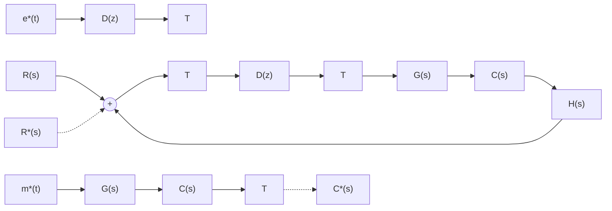

# 1. 数字控制器的脉冲传递函数

flowchart

图 7-41 具有数字控制器的离散系统

设离散系统如图 7-41 所示。图中， $D(z)$ 为数字控制器(数字校正装置)的脉冲传递函数， $G(s)$ 为保持器与被控对象的传递函数， $H(s)$ 为反馈测量装置的传递函数。

设 $H(s) = 1, G(s)$ 的 $z$ 变换为 $G(z)$ ，由图可以求出系统的闭环脉冲传递函数

$$\Phi (z) = \frac {D (z) G (z)}{1 + D (z) G (z)} = \frac {C (z)}{R (z)} \tag {7-85}$$

和误差脉冲传递函数

$$\Phi_ {e} (z) = \frac {1}{1 + D (z) G (z)} = \frac {E (z)}{R (z)} \tag {7-86}$$

则由式(7-85)和式(7-86)可以分别求出数字控制器的脉冲传递函数为

$$D (z) = \frac {\Phi (z)}{G (z) [ 1 - \Phi (z) ]} \tag {7-87}$$

或者

$$D (z) = \frac {1 - \Phi_ {e} (z)}{G (z) \Phi_ {e} (z)} \tag {7-88}$$

显然

$$\Phi_ {e} (z) = 1 - \Phi (z) \tag {7-89}$$

离散系统的数字校正问题是：根据对离散系统性能指标的要求，确定闭环脉冲传递函数 $\Phi(z)$ 或误差脉冲传递函数 $\Phi_e(z)$ ，然后利用式(7-87)或式(7-88)确定数字控制器的脉冲传递函数 $D(z)$ ，并加以实现。
