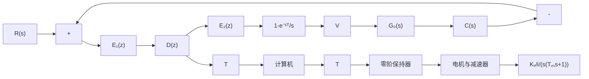

# (1) 最少拍系统产生纹波的原因

设单位反馈离散系统如图 7-46 所示, 它是按单位斜坡输入设计的最少拍系统, 其 T=1 。假定, $T_{m}=1$ , $K_{v}/i=10$ , 则 $G_{0}(s)=10/s(s+1)$ 。根据例 7-29 结果

$$
\begin{array}{l} D (z) = \frac {0 . 5 4 3 (1 - 0 . 3 6 8 z ^ {- 1}) (1 - 0 . 5 z ^ {- 1})}{(1 - z ^ {- 1}) (1 + 0 . 7 1 7 z ^ {- 1})} \\ E _ {1} (z) = \Phi_ {e} (z) R (z) = (1 - z ^ {- 1}) ^ {2} \frac {T z ^ {- 1}}{(1 - z ^ {- 1}) ^ {2}} = T z ^ {- 1} \\ \end{array}
$$

flowchart

图 7-46 有纹波最少拍系统

可得零阶保持器的输入序列 z 变换

$$
E _ {2} (z) = D (z) E _ {1} (z) = \frac {0 . 5 4 3 z ^ {- 1} - 0 . 4 7 1 z ^ {- 2} + 0 . 1 z ^ {- 3}}{1 - 0 . 2 8 3 z ^ {- 1} - 0 . 7 1 7 z ^ {- 2}}
\begin{array}{l} = 0. 5 4 3 z ^ {- 1} - 0. 3 1 7 z ^ {- 2} + 0. 4 z ^ {- 3} - 0. 1 1 4 z ^ {- 4} + 0. 2 5 5 z ^ {- 5} \\ - 0. 0 1 z ^ {- 6} + 0. 1 8 z ^ {- 7} - \dots \\ \end{array}
$$

line

| t | e₁(nT) |
| --- | --- |
| 0 | 0 |
| 1 | e₁(nT) |
| 2T | 0 |
| 4T | 0 |
| 6T | 0 |
| 8T | 0 |
| 10T | 0 |

scatter

| t | e₂(nT) |
| --- | --- |
| 0 | - |
| 2T | - |
| 4T | - |
| 6T | - |
| 8T | - |

bar

| Time | Voltage |
| --- | --- |
| 0 | 0 |
| 2T | High |
| 4T | Low |
| 6T | Medium |
| 8T | Low |

图 7-47 最少拍系统各点波形

显然，经过二拍以后，零阶保持器的输入序列 $e_2(nT)$ 并不是常值脉冲，而是围绕平均值上下波动，从而保持器的输出电压 $V$ 在二拍以后也围绕平均值波动。这样的电压 $V$ 加在电机上，必然使电机转速不平稳，产生输出纹波。图7-46系统中的各点波形，如图7-47所示。因此，无纹波输出就必须要求序列 $e_2(nT)$ 在有限个采样周期后，达到相对稳定（不波动）。要满足这一要求，除了采用前面介绍的最少拍系统设计方法外，还需要对被控对象传递函数 $G_0(s)$ 以及闭环脉冲传递函数 $\Phi(z)$ 提出相应的要求。
