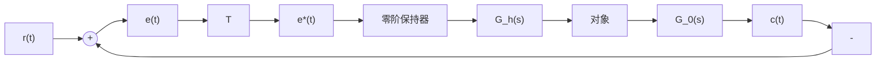

# 7-8 离散控制系统设计

例 7-31 二阶数据采样系统的性能

有零阶保持器的二阶采样系统如图 7-48 所示, 其中被控对象的传递函数为

$$G _ {0} (s) = \frac {K}{s (T _ {1} s + 1)}$$

flowchart

图 7-48 闭环采样系统

采样周期为 T，则开环脉冲传递函数为

$$
\begin{array}{l} G (z) = (1 - z ^ {- 1}) \mathscr {L} \left[ \frac {G _ {0} (s)}{s} \right] \\ = \frac {K T _ {1} \left[ \left(\mathrm{e} ^ {- T / T _ {1}} + T / T _ {1} - 1\right) z + \left(1 - \frac {T}{T _ {1}} \mathrm{e} ^ {- T / T _ {1}} - \mathrm{e} ^ {- T / T _ {1}}\right) \right]}{(z - 1) (z - \mathrm{e} ^ {- T / T _ {1}})} \\ \end{array}
$$

若令 $E=e^{-T/T_{1}}$ ，则上式可表示为

$$G (z) = \frac {K [ (E T _ {1} + T - T _ {1}) z + (T _ {1} - T E - T _ {1} E) ]}{(z - 1) (z - E)}$$

闭环特征方程为

$$D (z) = z ^ {2} + z \{K [ T - T _ {1} (1 - E) ] - (1 + E) \} + K [ T _ {1} (1 - E) - T E ] + E = 0$$

这是一个实系数的一元二次方程，由朱利稳定判据知，由于 $n = 2$ ，且

$$a _ {0} = K \left[ T _ {1} (1 - E) - T E \right] + E, a _ {1} = K \left[ T - T _ {1} (1 - E) \right] - (1 + E), a _ {2} = 1$$

故两个特征根都位于 $z$ 平面上单位圆内的充分必要条件为

$$D (1) > 0, \quad D (- 1) > 0$$

并满足约束条件 $|a_{0}|<a_{2}$ 。

当 $K > 0$ 及 $T > 0$ 时，可由 $\left|a_0\right| < 1$ 及 $D(-1) > 0$ 导出上述二阶采样系统稳定性的等价必要条件

$$K T _ {1} < \frac {1 - E}{1 - E - \frac {T}{T _ {1}} E}$$

以及 $KT_{1} < \frac{2(1 + E)}{\frac{T}{T_{1}}(1 + E) - 2(1 - E)}$

根据稳定性的必要条件,可以计算稳定系统所容许的最大增益。表 7-8 给出了 $T/T_{1}$ 为不同取值时所对应的最大增益。由表 7-8 可见,当计算机具有足够的运算速度时,可取 $T/T_{1}=0.1$ 。在此条件下,离散系统的增益上限取值较大,其系统特性与连续系统基本一致。

当增益 K 和采样周期 T 发生变化时，二阶采样系统的阶跃响应最大超调量如图 7-49 所示。

由 $G(z)$ 表达式可见, 本例为 I 型系统, 在单位斜坡输入作用下, 其稳态跟踪误差 $e_{s}(\infty)$ 可由式(7-81)算得

$$e _ {s} (\infty) = \frac {T}{K _ {v}}$$

式中， $K_{v}$ 可由式(7-82)确定为

表 7-8 二阶采样系统的最大增益

<table><tr><td> $T/T_1$ </td><td>0</td><td>0.01</td><td>0.1</td><td>0.5</td><td>1.0</td><td>2.0</td></tr><tr><td>E</td><td>1.0</td><td>0.990</td><td>0.905</td><td>0.607</td><td>0.368</td><td>0.135</td></tr><tr><td> $(KT_1)_{max}$ </td><td>∞</td><td>100</td><td>21.11</td><td>4.39</td><td>2.39</td><td>1.45</td></tr></table>

$$K _ {v} = \lim _ {z \rightarrow 1} (z - 1) G (z)$$

contour

