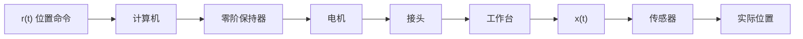
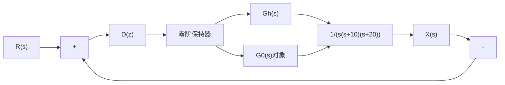
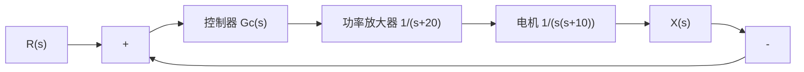

# 例 7-32 工作台控制系统

在制造业中,工作台运动控制系统是一个重要的定位系统,可以使工作台运动至指定的位置。工作台在每个轴上由电机和导引螺杆驱动,其中 x 轴上的运动控制系统框图如图 7-52 所示。

现要求设计数字控制器 $D(z)$ ，使系统满足如下性能：

1）超调量不大于5%；

2）具有较小的上升时间和调节时间( $\Delta=2\%$ )。

解 首先确定与图 7-52 相应的连续系统控制模型, 如图 7-53 所示。以连续系统为基础, 设计合适的控制器 $G_{c}(s)$ , 然后将 $G_{c}(s)$ 转换为要求的数字控制器 $D(z)$ 。

为了确定未校正系统的响应,先将控制器取为简单的增益 $K^{*}$ ,以 $K^{*}$ 为可变参数绘制系统的根轨迹,如图7-54所示,从中可得:当根轨迹增益 $K^{*}=641$ ,即开环增益K=3.2时,系统主导极点 $s_{1,2}=-3.72\pm j3.72$ 的阻尼比 $\zeta=0.707$ 。经仿真可得系统单位阶跃响应的性能,如表7-9中第一行所示。此时,系统的调节时间较长,系统时间响应及其相应的MATLAB文本,如图7-55所示。

表 7-9 采用不同控制器时连续系统的响应性能

<table><tr><td>控制器Gc(s)</td><td>K*</td><td>超调量/%</td><td>调节时间/s</td><td>上升时间/s</td></tr><tr><td>K*</td><td>641</td><td>4.33</td><td>1.25</td><td>0.68</td></tr><tr><td>K*(s+11)/s+62</td><td>7800</td><td>4.33</td><td>0.58</td><td>0.32</td></tr></table>

flowchart

(a) 执行机构和工作台  

flowchart

(b) 系统结构图

图 7-52 工作台控制系统  

flowchart

图 7-53 工作台的支撑轮控制模型

line

| Point Type | Value |
| --- | --- |
| System: G | 0.707 |
| Gain | 641 |
| Pole | -3.72 + 3.72i |
| Damping | 0.787 |
| Overshoot (%) | 4.33 |
| Frequency (rad/sec) | 5.26 |

图7-54 $1 + \frac{K^{*}}{s(s + 10)(s + 20)} = 0$ 的根轨迹图(MATLAB)

<table><tr><td>G0=tf([641],[1,30,200,0]);sys=feedback(G0,1); %建立闭环系统
t=0:0.01:2;step(sys,t);grid; %绘制阶跃响应曲线</td></tr></table>

(a) MATLAB 文本
