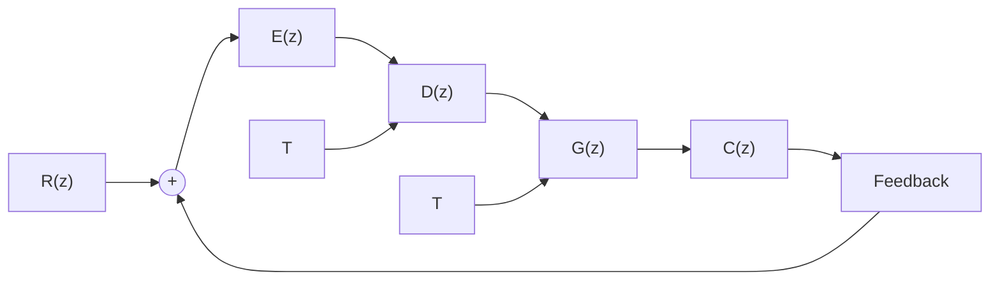

$$\mathrm{T} = 0. 0 1; \quad \mathrm{t} = 0: \mathrm{T}: 0. 8;\mathrm{G0} = \mathrm{zpk} ([ 0. 8 9 5 8 ], [ 0. 5 3 7 9, 1, 0. 9 0 5, 0. 8 1 9 ],0. 0 0 8 * 0. 6 1 3 7 1, \mathrm{T});\mathrm{sys} = \text { feedback } (\mathrm{G0}, 1); \quad \% \text { 建立闭环系统 }\text { step(sys,t);grid; } \quad \% \text { 绘制单位阶跃响应曲线 }$$

图 7-58 超前校正离散系统的时间响应(MATLAB)

例 7-33 磁盘驱动读取系统(续)

对于图 3-46 所示的磁盘驱动读取系统, 当磁盘旋转时, 每读一组存储数据, 磁头都会提取位置偏差信息。由于磁盘匀速运转, 因此磁头以恒定的时间间隔逐次读取格式信息。通常, 偏差信号的采样周期介于 $100 \mu s \sim 1 ms$ 之间。

设磁盘驱动采样读取系统结构图如图7-59所示。图中， $G(z) = \mathcal{L}[G_h(z)G_0(z)]$ 为广义对象脉冲传递函数， $G_{h}(s) = \frac{1 - \mathrm{e}^{-sT}}{s}$ 为零阶保持器， $G_{0}(s) = \frac{5}{s(s + 20)}$ 为被控对象， $D(z)$ 为数字控制器。

flowchart

图 7-59 磁盘驱动采样读取系统

当 T=1ms 时，要求设计数字控制器 $D(z)$ ，使图 7-59 系统具有满意的动态响应性能。

解 广义对象脉冲传递函数

$$
\begin{array}{l} G (z) = \mathcal {L} \left[ \frac {1 - e ^ {- T s}}{s} \cdot \frac {5}{s (s + 2 0)} \right] \\ = (1 - z ^ {- 1}) \mathscr {L} \left[ \frac {5}{s ^ {2} (s + 2 0)} \right] \\ = (1 - z ^ {- 1}) \mathcal {X} \left[ \frac {0 . 2 5}{s ^ {2}} - \frac {0 . 0 1 2 5}{s} + \frac {0 . 0 1 2 5}{s + 2 0} \right] \\ = (1 - z ^ {- 1}) \left[ \frac {0 . 2 5 T z}{(z - 1) ^ {2}} - \frac {0 . 0 1 2 5 z}{z - 1} + \frac {0 . 0 1 2 5 z}{z - e ^ {- 2 0 T}} \right] \\ \end{array}
$$

因为 $T = 0.001\mathrm{s},z - \mathrm{e}^{-20T} = z - 0.98$ ，所以

$$G (z) = \frac {5 \times 1 0 ^ {- 6}}{(z - 1) (z - 0 . 9 8)}$$

为了快速读取磁盘信息,要求系统在单位阶跃输入下为一拍系统。查表 7-7 知,应有

$$\Phi (z) = z ^ {- 1}, \quad \Phi_ {e} (z) = 1 - z ^ {- 1}$$

故由

$$D (z) = \frac {1 - \Phi_ {e} (z)}{G (z) \Phi_ {e} (z)} = \frac {\Phi (z)}{G (z) \Phi_ {e} (z)}$$

求得数字控制器

$$D (z) = 2 \times 1 0 ^ {5} (z - 0. 9 8)$$

利用 MATLAB 软件包进行仿真验证, 其单位阶跃响应及相应的 MATLAB 文本如图 7-60 所示。由图可见, 超调量为零, 调节时间为 1ms, 系统具有稳定且快速的响应。

$$
\begin{array}{l} \mathrm{T} = 0. 0 0 1; \mathrm{t} = 0: \mathrm{T}: 0. 0 1; \\ G 0 = z p k ([ ], [ 1 0. 9 8 ], 5 * 1 0 ^ {-} - 6, T); \\ \mathrm{Dz} = \mathrm{zpk} ([ 0. 9 8 ], [ ], 2 * 1 0 ^ {- 5}, \mathrm{T}); \\ G = \text { series } (G z, D z); \text { sys } = \text { feedback } (G, 1); \\ \text { step(sys,t);grid; } \\ \end{array}
$$

%离散开环系统的传递函数

% 数字控制器

% 离散闭环系统的传递函数

% 闭环系统的单位阶跃响应

(a) MATLAB 文本

line

| Time/sec | Amplitude |
| --- | --- |
| 0.001 | 1.0 |
| 0.006 | 1.0 |

图 7-60 磁盘驱动读取采样系统的单位阶跃响应(MATLAB)
