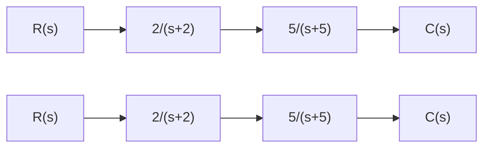

# 7-10 试求图 7-62 闭环离散系统的脉冲传递函数 $\Phi(z)$ 或输出 z 变换 $C(z)$ 。

flowchart

```mermaid
graph LR
    A["R(s)"] --> B["2/(s+2)"]
    B --> C["5/(s+5)"]
    C --> D["C(s)"]
    
    E["R(s)"] --> F["2/(s+2)"]
    F --> G["5/(s+5)"]
    G --> H["C(s)"]
```

图 7-61 开环离散系统

  
图 7-62 闭环离散系统
