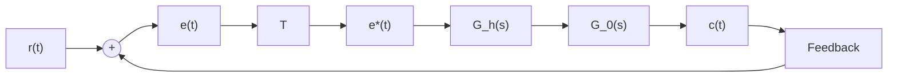

# 7-14 设离散系统如图 7-63 所示, 采样周期 T=1s, $G_{h}(s)$ 为零阶保持器,

flowchart

```mermaid
graph LR
    A["r(t)"] --> B((+))
    B --> C["e(t)"]
    C --> D["T"]
    D --> E["e*(t)"]
    E --> F["G_h(s)"]
    F --> G["G_0(s)"]
    G --> H["c(t)"]
    H --> I["Feedback"]
    I --> B
```

图 7-63 离散系统

$$G _ {0} (s) = \frac {K}{s (0 . 2 s + 1)}$$

要求：

(1) 当 K=5 时, 分别在 z 域和 w 域中分析系统的稳定性;  
(2) 确定使系统稳定的 K 值范围。
