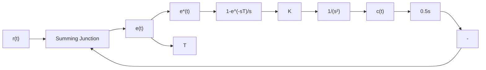
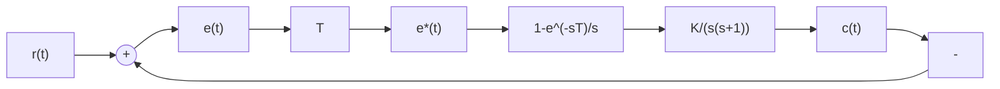
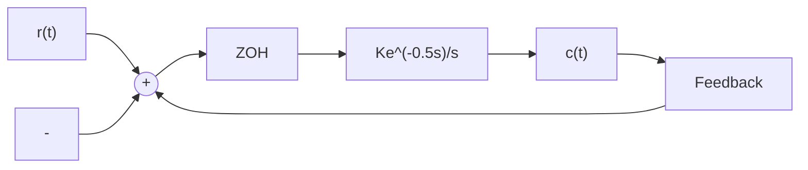
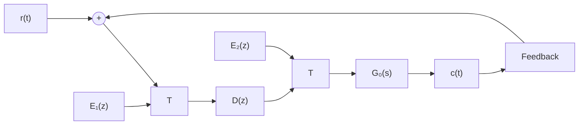
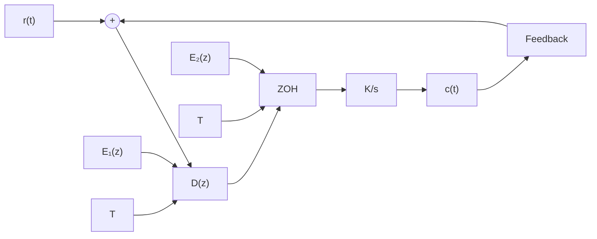

# 7-15 设离散系统如图 7-64 所示, 其中采样周期 T=0.2, K=10, $r(t)=1+t+t^{2}/2$ , 试用终值定理法计算系统的稳态误差 $e_{s}(\infty)$ 。

flowchart

图 7-64 闭环离散系统

7-16 设离散系统如图 7-65 所示, 其中 $T = 0.1, K = 1, r(t) = t$ , 试求静态误差系数 $K_{p}, K_{v}$ , $K_{a}$ , 并求系统稳态误差 $e_{s}(\infty)$ 。  
7-17 已知离散系统如图 7-66 所示, 其中 ZOH 为零阶保持器, T=0.25。当 $r(t)=2+t$ 时, 欲使稳态误差小于 0.1, 试求 K 值。

flowchart

图 7-65 闭环离散系统

flowchart

图 7-66 闭环离散系统

7-18 试分别求出图 7-64 和图 7-65 系统的单位阶跃响应 $c(nT)$ 。  
7-19 已知离散系统如图 7-67 所示, 其中采样周期 T=1, 连续部分传递函数

$$G _ {0} (s) = \frac {1}{s (s + 1)}$$

试求当 $r(t)=1(t)$ 时，系统无稳态误差、过渡过程在最少拍内结束的数字控制器 $D(z)$ 。

7-20 设离散系统如图 7-68 所示, 其中采样周期 T=1, 试求当 $r(t)=R_{0}1(t)+R_{1}t$ 时, 系统无稳态误差、过渡过程在最少拍内结束的 $D(z)$ 。

flowchart

图 7-67 离散系统

flowchart

图 7-68 离散系统

7-21 试按无纹波最少拍系统设计方法,分别算出题 7-19 和题 7-20 的 $D(z)$ 。  
7-22 用来直播职业足球赛的新型可遥控摄像系统如图 7-69 所示。摄像机可在运动场上方上下移动。每个滑轮上的电机控制系统如图 7-70 所示，其中被控对象
