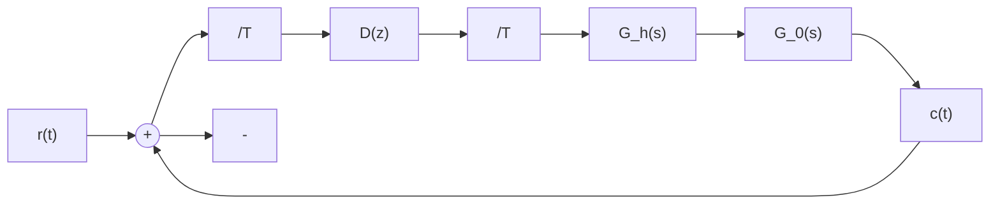
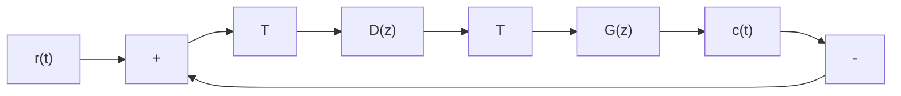
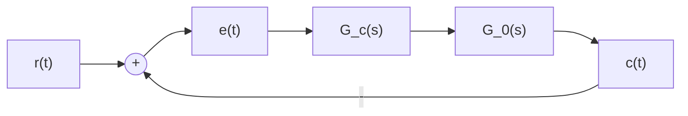

$$G _ {0} (s) = \frac {1 0}{s (s + 1) (0 . 1 s + 1)}$$

text_image

摄像机
电机和
滑轮

图 7-69 足球场上的移动摄像机

flowchart

图 7-70 滑轮上的电机控制系统

要求：

(1) 设计合适的连续控制器 $G_{c}(s)=\frac{s+a}{s+b}$ ，使系统的相角裕度 $\gamma\geqslant45^{\circ}$ ;  
(2) 选择采样周期 T=0.01s，采用 $G_{c}(s)-D(z)$ 变换方法，求出相应的数字控制器 $D(z)$ 。

7-23 设数字控制系统如图 7-71 所示, 其中 $G(z)$ 包括了零阶保持器和被控对象。已知被控对象

$$G _ {0} (s) = \frac {1}{s (s + 1 0)}$$

若采样周期 T=0.1s，要求：

(1) 当 $D(z)=K$ 时，计算脉冲传递函数 $G(z)D(z)$ ;  
(2) 求闭环系统的 z 特征方程；  
(3) 计算使系统稳定的 K 的最大值；  
(4) 确定 K 的合适值, 使系统的超调量不大于 30%;  
(5) 采用(4)中得到的增益 K，计算闭环脉冲传递函数 $\Phi(z)$ ，并绘出系统的单位阶跃响应曲线；  
(6) 取 $K=0.5K_{max}$ ，求系统闭环极点及超调量；  
(7) 在(6)所给出的条件下, 画出系统的单位阶跃响应曲线。

7-24 设连续的、未经采样的控制系统如图 7-72 所示, 其中被控对象

flowchart

图 7-71 数字控制系统

flowchart

图 7-72 控制系统

$$G _ {0} (s) = \frac {1}{s (s + 1 0)}$$

要求：

(1) 设计滞后校正网络

$$G _ {c} (s) = K \frac {s + a}{s + b} \quad (a > b)$$

使系统在单位阶跃输入时的超调量 $\sigma \% \leqslant 30\%$ ，且在单位斜坡输入时的稳态误差 $e_{s}(\infty) \leqslant 0.01$

(2) 若为该系统增配一套采样器和零阶保持器, 并选采样周期 $T = 0.1 \mathrm{~s}$ , 试采用 $G_{c}(s) - D(z)$ 变换方法, 设计合适的数字控制器 $D(z)$ ;  
(3) 分别画出(1)及(2)中连续系统和离散系统的单位阶跃响应曲线,并比较两者的结果;  
(4) 另选采样周期 T=0.01s，重新完成(2)和(3)的工作；  
(5) 对于(2)中得到的 $D(z)$ ，画出离散系统的单位斜坡响应，并与连续系统的单位斜坡响应进行比较。

7-25 设闭环采样系统如图 7-73 所示, 若采样周期在 $0 \leqslant T \leqslant 1.2\mathrm{s}$ 范围内变化, 试在 $T$ 每增加 $0.2\mathrm{s}$ 之后, 绘出系统的单位阶跃输入响应, 要求列表记录相应的 $\sigma \%$ 和 $t_s (\Delta = 2\%)$ 。

