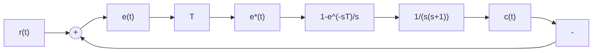

flowchart

```mermaid
graph LR
    A["r(t)"] --> B((+))
    B --> C["e(t)"]
    C --> D["T"]
    D --> E["e*(t)"]
    E --> F["1-e^(-sT)/s"]
    F --> G["1/(s(s+1))"]
    G --> H["c(t)"]
    H --> I["-"]
    I --> B
```

图 7-73 闭环采样系统

7-26 设具有采样器、零阶保持器的闭环采样系统如图 7-74 所示, 当采样周期 T=0.1s, 输入信号为单位阶跃信号时, 试计算系统的输出 $C(z)$ 。

flowchart

```mermaid
graph LR
    A["r(t)"] --> B((+))
    B --> C["e(t)"]
    C --> D["T"]
    D --> E["G_h(s)/1-e^(-sT)/s"]
    E --> F["G_0(s)/10/(s-2)"]
    F --> G["c(t)"]
    G --> H["Feedback"]
    H --> B
```

图 7-74 闭环采样系统
