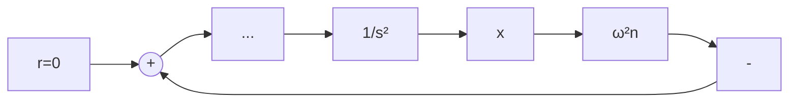

# (2) 可能存在自激振荡现象

所谓自激振荡是指没有外界周期变化信号的作用时，系统内产生的具有固定振幅和频率的稳定周期运动，简称自振。线性定常系统只有在临界稳定的情况下才能产生周期运动。考虑图8-4所示系统，设初始条件 $x(0) = x_0, \dot{x}(0) = \dot{x}_0$ ，系统

line

| t | x(t) for x₀>1 | x(t) for x₀<1 |
| --- | --- | --- |
| 0 | 0 | 0 |
| 1 | ~0.5 | ~-0.2 |
| 2 | ~1.0 | ~-0.4 |
| 3 | ~1.5 | ~-0.6 |
| 4 | ~2.0 | ~-0.8 |
| 5 | ~2.5 | ~-1.0 |
| 6 | ~3.0 | ~-1.2 |
| 7 | ~3.5 | ~-1.4 |
| 8 | ~4.0 | ~-1.6 |
| 9 | ~4.5 | ~-1.8 |
| 10 | ~5.0 | ~-2.0 |
| 11 | ~5.5 | ~-2.2 |
| 12 | ~6.0 | ~-2.4 |
| 13 | ~6.5 | ~-2.6 |
| 14 | ~7.0 | ~-2.8 |
| 15 | ~7.5 | ~-3.0 |
| 16 | ~8.0 | ~-3.2 |
| 17 | ~8.5 | ~-3.4 |
| 18 | ~9.0 | ~-3.6 |
| 19 | ~9.5 | ~-3.8 |
| 20 | ~10.0 | ~-4.0 |
| 21 | ~10.5 | ~-4.2 |
| 22 | ~11.0 | ~-4.4 |
| 23 | ~11.5 | ~-4.6 |
| 24 | ~12.0 | ~-4.8 |
| 25 | ~12.5 | ~-5.0 |
| 26 | ~13.0 | ~-5.2 |
| 27 | ~13.5 | ~-5.4 |
| 28 | ~14.0 | ~-5.6 |
| 29 | ~14.5 | ~-5.8 |
| 30 | ~15.0 | ~-6.0 |
| 31 | ~15.5 | ~-6.2 |
| 32 | ~16.0 | ~-6.4 |
| 33 | ~16.5 | ~-6.6 |
| 34 | ~17.0 | ~-6.8 |
| 35 | ~17.5 | ~-7.0 |
| 36 | ~18.0 | ~-7.2 |
| 37 | ~18.5 | ~-7.4 |
| 38 | ~19.0 | ~-7.6 |
| 39 | ~19.5 | ~-7.8 |
| 40 | ~20.0 | ~-8.0 |
| 41 | ~20.5 | ~-8.2 |
| 42 | ~21.0 | ~-8.4 |
| 43 | ~21.5 | ~-8.6 |
| 44 | ~22.0 | ~-8.8 |
| 45 | ~22.5 | ~-9.0 |
| 46 | ~23.0 | ~-9.2 |
| 47 | ~23.5 | ~-9.4 |
| 48 | ~24.0 | ~-9.6 |
| 49 | ~24.5 | ~-9.8 |
| 50 | ~25.0 | ~-10.0 |
| 51 | ~25.5 | ~-10.2 |
| 52 | ~26.0 | ~-10.4 |
| 53 | ~26.5 | ~-10.6 |
| 54 | ~27.0 | ~-10.8 |
| 55 | ~27.5 | ~-11.0 |
| 56 | ~28.0 | ~-11.2 |
| 57 | ~28.5 | ~-11.4 |
| 58 | ~29.0 | ~-11.6 |
| 59 | ~29.5 | ~-11.8 |
| 60 | ~30.0 | ~-12.0 |
| 61 | ~30.5 | ~-12.2 |
| 62 | ~31.0 | ~-12.4 |
| 63 | ~31.5 | ~-12.6 |
| 64 | ~32.0 | ~-12.8 |
| 65 | ~32.5 | ~-13.0 |
| 66 | ~33.0 | ~-13.2 |
| 67 | ~33.5 | ~-13.4 |
| 68 | ~34.0 | ~-13.6 |
| 69 | ~34.5 | ~-13.8 |
| 70 | ~35.0 | ~-14.0 |
| 71 | ~35.5 | ~-14.2 |
| 72 | ~36.0 | ~-14.4 |
| 73 | ~36.5 | ~-14.6 |
| 74 | ~37.0 | ~-14.8 |
| 75 | ~37.5 | ~-15.0 |
| 76 | ~38.0 | ~-15.2 |
| 77 | ~38.5 | ~-15.4 |
| 78 | ~39.0 | ~-15.6 |
| 79 | ~39.5 | ~-15.8 |
| 80 | ~40.0 | <ln(x₀/x₀−1) |

图8-3 非线性一阶系统的时间响应曲线

flowchart

图 8-4 二阶零阻尼线性系统

$$\ddot {x} + \omega_ {n} ^ {2} x = 0 \tag {8-8}$$

用拉普拉斯变换法求解该微分方程得

$$X (s) = \frac {s x _ {0} + \dot {x} _ {0}}{s ^ {2} + \omega_ {n} ^ {2}} \tag {8-9}$$

系统自由运动
