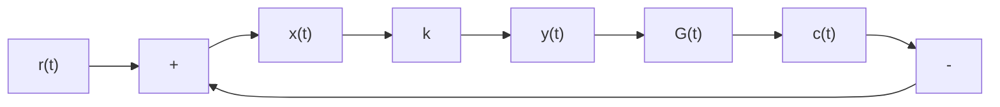

# 2. 常见非线性因素对系统运动的影响

非线性特性对系统性能的影响是多方面的，难以一概而论。为便于定性分析，采用图8-7所示的结构形式, 图中 k 为非线性特性的等效增益, $G(s)$ 为最小相位线性部分的传递函数。当忽略或不考虑非线性因素, 即 k 为常数时, 非线性系统表现为线性系统, 因此非线性系统的分析可在线性系统分析的基础上加以推广。由于非线性特性用等效增益表示, 图 8-7 所示非线性系统的开环零极点与开环增益为 $k \cdot K$ 时的线性系统的零极点相同, 其中 K 为线性部分开环增益。非线性因素对系统运动的影响体现为通过开环增益的变化改变系统的闭环极点的位置。

flowchart

图 8-7 等效增益表示的非线性系统
