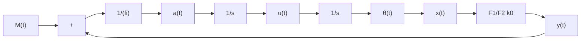

# (5) 摩擦特性

摩擦对系统性能的影响最主要的是造成系统低速运动的不平滑性，即当系统的输入轴作低速平稳运转时，输出轴的旋转呈现跳跃式的变化。这种低速爬行现象是由静摩擦到动摩擦的跳变产生的。传动机构的结构图如图8-9(a)所示，其中 $J$ 为转动惯量， $i$ 为齿轮系速比， $\theta(t)$ 为输出轴角度，由于输入转矩需要克服静态转矩 $F_{1}$ 方使输出轴由静止开始转动，而一旦输出轴转动，摩擦转矩即由 $F_{1}$ 迅速降为动态转矩 $F_{2}$ ，因而造成输出轴在小角度(零附近)产生跳跃式变化。反映在等效增益上，在 $x(t)$ 为零处表现为能量为 $F_{1}$ 的正脉冲和能量为 $F_{1}-F_{2}$ 的负脉冲。对于雷达、天文望远镜、火炮等高精度控制系统，这种脉冲式的输出变化产生的低速爬行现象往往导致不能跟踪目标，甚至丢失目标，如图8-9(b)中虚线所示。

以上主要是通过等效增益概念在一般意义上针对特定的系统定性分析了常见非线性因素对系统性能的影响，在其他情况下不一定适用，具体问题必须具体分析。而欲获得较为准确的结论，还应采用有效的方法对非线性系统作进一步的定量分析和研究。

flowchart

line

| x | Solid Line | Dashed Line 1 | Dashed Line 2 |
| --- | --- | --- | --- |
| 0 | 0 | 0 | 0 |
| 2 | 1 | 2 | 2 |
| 4 | 2 | 4 | 3 |
| 6 | 4 | 6 | 7 |
| 8 | 6 | 8 | 8 |
| 10 | 8 | 10 | 10 |
| 12 | 10 | 12 | 12 |
| 14 | 12 | 14 | 14 |
| 16 | 14 | 16 | 16 |
| 18 | 16 | 18 | 18 |
| 20 | 18 | 20 | 20 |

图 8-9 传动机构结构图和摩擦特性影响(Simulink)
