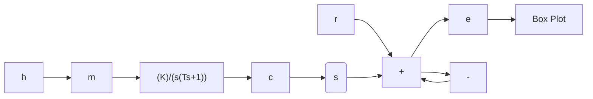

# (3) 具有滞环继电特性的非线性控制系统

非线性系统结构如图 8-33 所示， $H(s)$ 为反馈网络， $r(t)=0$ 。

1）单位反馈 $H(s)=1$ 。根据滞环继电特性分区间列写微分方程如下：

$$T \ddot {c} + \dot {c} + K M _ {0} = 0, \qquad c > h \text {或} c > - h, \dot {c} < 0 (8 - 4 7)T \ddot {c} + \dot {c} - K M _ {0} = 0, \qquad c < - h \text {或} c < h, \dot {c} > 0$$

由式(8-47)易知，三条开关线 $c = h, \dot{c} > 0; c = -h$ ， $\dot{c} < 0$ 和 $-h < c < h, \dot{c} = 0$ 将相平面划分为左右两个区域。根据式(8-45)的分析结果，左区域内存在一条特殊的相轨迹 $\dot{c} = KM_0 (k = \alpha = 0)$ ，右区域内亦存在一条特殊的相轨迹 $\dot{c} = -KM_0$ 。所绘制的系统相平

flowchart

图 8-33 具有滞环继电特性的非线性系统

面图如图8-34所示。横轴上区间 $(-h, h)$ 为发散段，即初始点位于该线段时，相轨迹运动呈向外发散形式，初始点位于该线段附近时也同样向外发散；而由远离该线段的初始点出发的相轨迹均趋向于两条特殊的等倾线，即向内收敛，故而介于从内向外发散和从外向内收敛的相轨迹之间，存在一条闭合曲线MNKLM，构成极限环。按极限环定义，该极限环为稳定的极限环。因此在无外作用下，不论初始条件如何，系统最终都将处于自振状态。而在输入为 $r(t) = R \cdot 1(t)$ 条件下，仍有

$$T \ddot {e} + \dot {e} + K M _ {0} = T \ddot {r} + \dot {r} = 0, \qquad e > h \text {或} e > - h, \dot {e} < 0 \tag {8-48}T \ddot {e} + \dot {e} - K M _ {0} = T \ddot {r} + \dot {r} = 0, \qquad e < - h \text {或} e < h, \dot {e} > 0$$

系统状态 $e(t)$ , $\dot{e}(t)$ 仍将最终处于自振状态。可见滞环特性恶化了系统的品质，使系统处于失控状态。

2）速度反馈 $H(s) = 1 + \tau s(0 < \tau < T)$ 。滞环非线性因素对系统影响的定性分析和相平面法分析表明，滞环的存在导致了控制的滞后，为补偿其不利影响，引入输出的速度反馈，以期改善非线性系统的品质。

加入速度反馈控制以后，非线性系统在无输入作用下的微分方程为

$$T \ddot {c} + \dot {c} + K M _ {0} = 0, \qquad c + \tau \dot {c} > h \text {或} c + \tau \dot {c} > - h, \dot {c} + \tau \ddot {c} < 0 \tag {8-49}T \ddot {c} + \dot {c} - K M _ {0} = 0, \qquad c + \tau \dot {c} < - h \text {或} c + \tau \dot {c} < h, \dot {c} + \tau \ddot {c} > 0$$

由滞环继电特性可知，式(8-49)中方程的第二个条件只是在 $-h < c + \tau c < h$ 区域内保持非线性环节输出为 $KM_0$ 或 $-KM_0$ 的条件。设直线 $L_1: c + \tau c = h, L_2: c + \tau c = -h$ 。当相轨迹点位于第IV象限 $(\dot{c} < 0)$ 且位于 $L_1$ 上方以及 $L_1$ 上时

$$\dot {c} + \tau \ddot {c} = \frac {\tau}{T} (T \ddot {c} + \dot {c}) + \dot {c} \left(1 - \frac {\tau}{T}\right) = \frac {\tau}{T} (- K M _ {0}) + \dot {c} \left(1 - \frac {\tau}{T}\right) < 0$$
