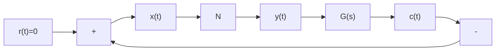

$$
I _ {n} = \int_ {0} ^ {\frac {\pi}{2}} \sin^ {n} \omega t \mathrm{d} \omega t = \left\{ \begin{array}{l l} \frac {(n - 1) (n - 3) \times \cdots \times 4 \times 2}{n (n - 2) (n - 4) \times \cdots \times 5 \times 3}, & n \text {为奇整数} \\ \frac {(n - 1) (n - 3) \times \cdots \times 5 \times 3 \times 1}{n (n - 2) \times \cdots \times 4 \times 2} \cdot \frac {\pi}{2}, & n \text {为偶整数} \end{array} \right. \tag {8-65}
$$

得 $B_{1} = \frac{4}{\pi}\left(\frac{A}{2}\cdot \frac{\pi}{4} +\frac{A^{3}}{4}\cdot \frac{3}{8}\cdot \frac{\pi}{2}\right) = \frac{A}{2} +\frac{3}{16} A^{3}$

则该非线性元件的描述函数为

$$N (A) = \frac {B _ {1}}{A} = \frac {1}{2} + \frac {3}{1 6} A ^ {2} \tag {8-66}$$

(2) 非线性系统描述函数法分析的应用条件

1) 非线性系统应简化成一个非线性环节和一个线性部分闭环连接的典型结构形式, 如图 8-36 所示。

flowchart

图 8-36 非线性系统典型结构形式

2) 非线性环节的输入输出特性 $y(x)$ 应是 $x$ 的奇函数，即 $f(x) = -f(-x)$ ，或正弦输入下的输出为 $t$ 的奇对称函数，即 $y\left(t + \frac{\pi}{\omega}\right) = -y(t)$ ，以保证非线性环节的正弦响应不含有常值分量，

即 $A_{0}=0$ 。

3）系统的线性部分应具有较好的低通滤波性能。当非线性环节的输入为正弦信号时，实际输出必定含有高次谐波分量,但经线性部分传递之后,由于低通滤波的作用,高次谐波分量将被大大削弱,因此闭环通道内近似地只有一次谐波分量流通,从而保证应用描述函数分析方法所得的结果比较准确。对于实际的非线性系统,大部分都容易满足这一条件。线性部分的阶次越高,低通滤波性能越好;而欲具有低通滤波性能,线性部分的极点应位于复平面的左半平面。
