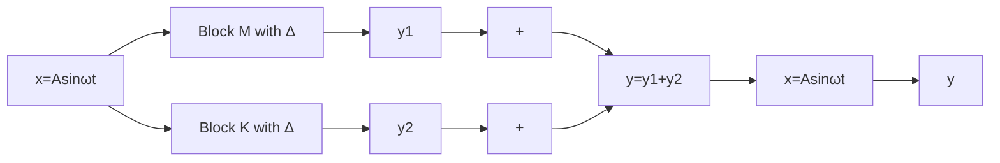

# (1) 非线性特性的并联

若两个非线性特性输入相同,输出相加、减,则等效非线性特性为两个非线性特性的叠加。图 8-39为死区非线性和死区继电非线性并联的情况。

flowchart

```mermaid
graph LR
    A["x=Asinωt"] --> B["Block M with Δ"]
    A --> C["Block K with Δ"]
    B --> D["y1"]
    C --> E["y2"]
    D --> F["+"]
    E --> G["+"]
    F --> H["y=y1+y2"]
    G --> H
    H --> I["x=Asinωt"]
    I --> J["y"]
```

图 8-39 非线性特性并联时的等效非线性特性

由描述函数定义,并联等效非线性特性的描述函数为各非线性特性描述函数的代数和。
