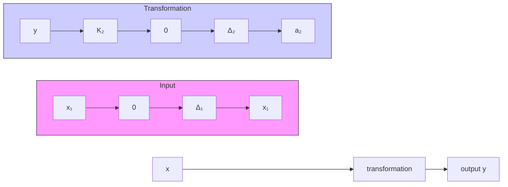

# (2) 非线性特性的串联

若两个非线性环节串联,可采用图解法简化。以图 8-40 所示死区特性和死区饱和特性串联简化为例。

通常，先将两个非线性特性按图8-41(a)，(b)形式放置，再按输出端非线性特性的变化端点 $\Delta_2$ 和 $a_2$ 确定输入 $x$ 的对应点 $\Delta$ 和 $a$ ，获得等效非线性特性如图8-41(c)所示，最后确定等效非线性的参数。由 $\Delta_2 = K_1(\Delta -\Delta_1)$ ，得

$$\Delta = \Delta_ {1} + \frac {\Delta_ {2}}{K _ {1}} \tag {8-80}$$

flowchart

图 8-40 非线性特性串联

text_image

-a₂
-Δ₂
0
Δ₂
a₂
x₁
K₂
(a)
-a
-Δ
0
Δ
a
x
K
(c)
-Δ₁
0
x₁
Δ₁
K₁
a
x
(b)

图 8-41 非线性串联简化的图解方法

由 $a_2 = K_1(a - \Delta_1)$ 得

$$a = \frac {a _ {2}}{K _ {1}} + \Delta_ {1} \tag {8-81}$$

当 $|x|\leqslant \Delta$ 时，由 $y(x_{1})$ 特性知， $y(x) = 0$ ；当 $|x|\geqslant a$ 时，由 $y(x_{1})$ 可知， $y(x) = K_{2}(a_{2} - \Delta_{2})$ ；当 $\Delta < |x| < a$ 时， $y(x_{1})$ 位于线性区， $y(x)$ 亦呈线性，设斜率为 $K$ ，即有

$$y (x) = K (x - \Delta) = K _ {2} (x _ {1} - \Delta_ {2})$$

特殊地，当 $x = a$ 时， $x_{1} = a_{2}$ ，由于 $x_{1} = \Delta_{2} + K_{1}(a - \Delta)$ ，故 $a - \Delta = \frac{a_2 - \Delta_2}{K_1}$ ，因此 $K = K_{1}K_{2}$ 。

应该指出,两个非线性环节的串联,等效特性还取决于其前后次序。调换次序则等效非线性特性亦不同。描述函数需按等效非线性环节的特性计算。多个非线性特性串联,可按上述两个非线性环节串联简化方法,依由前向后顺序逐一加以简化。
