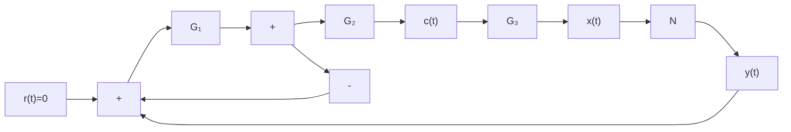
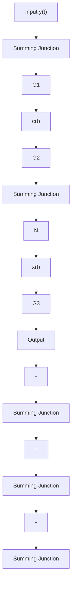

# 4. 非线性系统稳定性分析的描述函数法

若非线性系统经过适当简化后,具有图 8-36 所示的典型结构形式,且非线性环节和线性部分满足描述函数法应用的条件,则非线性环节的描述函数可以等效为一个具有复变增益的比例环节。于是非线性系统经过谐波线性化处理后已变成一个等效的线性系统,可以应用线性系统理论中的频率域稳定判据分析非线性系统的稳定性。


<details>
<summary>flowchart</summary>


</details>

(a)


<details>
<summary>flowchart</summary>


</details>

(b)


<details>
<summary>flowchart</summary>

```mermaid
graph LR
    A["+"] -->|x(t)| B["N"]
    B -->|y(t)| C["\frac{G_2G_3}{1+G_1G_2}"]
    C --> D["c(t)"]
    D --> E["-"]
    E --> A
```
</details>

(c)   
图 8-42 非线性系统等效变换
