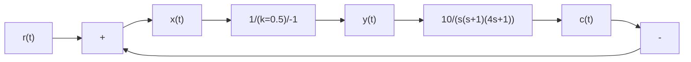

# (2) 应用描述函数分析非线性系统的稳定性

上述分析为应用描述函数判定非线性系统的稳定性奠定了基础。由于要求 $G(s)$ 具有低通特性，故其极点均应位于 $s$ 的左半平面。当非线性特性采用描述函数近似等效时，闭环系统的特征方程为

$$1 + N (A) G (\mathrm{j} \omega) = 0 \tag {8-84}$$

即为

$$G (\mathrm{j} \omega) = - \frac {1}{N (A)} \tag {8-85}$$

称 $-\frac{1}{N(A)}$ 为非线性环节的负倒描述函数。在复平面上绘制 $\Gamma_{G}$ 曲线和 $-\frac{1}{N(A)}$ 曲线时， $-\frac{1}{N(A)}$ 曲线上箭头表示随A增大， $-\frac{1}{N(A)}$ 的变化方向。

若 $\Gamma_G$ 曲线和 $-\frac{1}{N(A)}$ 曲线无交点，表明式(8-84)无 $\omega$ 的正实数解。图8-44给出了这一条件下的两种可能的形式。

图 8-44(a) 中， $\Gamma_{G}$ 曲线包围 $-\frac{1}{N(A)}$ 曲线，对于非线性环节具有任一确定振幅 A 的正弦输入信号， $\left(-\frac{1}{N(A)}, j0\right)$ 点被 $\Gamma_{G}$ 包围，此时系统不稳定，A 将增大，并最终使 A 增大到极限位置或使系统发生故障。

图 8-44(b) 中, $\Gamma_{G}$ 曲线不包围 $-\frac{1}{N(A)}$ 曲线, 对于非线性环节的具有任一确定振幅 A 的正弦信号, 点 $\left(\mathrm{Re}\left(-\frac{1}{N(A)}, \mathrm{Im}\left(-\frac{1}{N(A)}\right)\right)\right)$ 不被 $\Gamma_{G}$ 曲线包围, 此时系统稳定, A 将减小, 并最终使 A 减小为零或使非线性环节的输入值为某定值, 或位于该定值附近较小的范围。

text_image

G(jω)
-1/N(A)
0
ω

(a)

text_image

-1/N(A)
G(jω)
0
j
ω

(b)   
图8-44 $\Gamma_G$ 曲线和 $-\frac{1}{N(A)}$ 曲线无交点的两种形式

综上可得非线性系统的稳定性判据：若 $\Gamma_{G}$ 曲线不包围 $-\frac{1}{N(A)}$ 曲线，则非线性系统稳定；若 $\Gamma_{G}$ 曲线包围 $-\frac{1}{N(A)}$ 曲线，则非线性系统不稳定。

flowchart

图 8-45 例 8-5 非线性系统结构图

例 8-5 已知非线性系统结构如图 8-45 所示,试分析系统的稳定性。

解 对于线性环节, 令 K=10, $T_{1}=1$ , $T_{2}=4$ ,
解得穿越频率及相应线性部分的幅值为

$$\omega_ {x} = \frac {1}{\sqrt {T _ {1} T _ {2}}} = \frac {1}{2}G (\mathrm{j} \omega_ {x}) = \frac {- K T _ {1} T _ {2}}{T _ {1} + T _ {2}} = - 8$$

非线性环节为库仑摩擦加黏性摩擦，由表8-1得

$$
\begin{array}{l} - \frac {1}{N (A)} = \frac {- 1}{k + \frac {4 M}{\pi A}} \\ - \frac {1}{N (0)} = 0, - \frac {1}{N (\infty)} = - \frac {1}{k} = - 2 \\ \end{array}
$$

作 $\Gamma_G$ 曲线和 $-\frac{1}{N(A)}$ 曲线如图8-46所示，图中 $\Gamma_{G}$ 曲线包围 $-\frac{1}{N(A)}$ 曲线。根据非线性系统稳定判据，该非线性系统不稳定。
