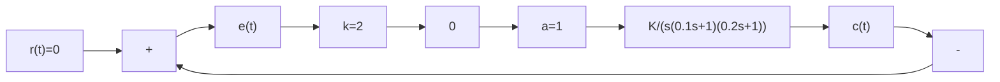

图 8-48 具有饱和非线性特性的控制系统

解 1) 由表 8-1 查得饱和非线性特性的描述函数为

$$N (A) = \frac {2 k}{\pi} \left[ \arcsin \frac {a}{A} + \frac {a}{A} \sqrt {1 - \left(\frac {a}{A}\right) ^ {2}} \right], \qquad A \geqslant a \tag {8-88}$$

取 $u = \frac{a}{A}$ ，对 $N(u)$ 求导得

$$\frac {\mathrm{d} N (u)}{\mathrm{d} u} = \frac {2 k}{\pi} \left(\frac {1}{\sqrt {1 - u ^ {2}}} + \sqrt {1 - u ^ {2}} - \frac {u ^ {2}}{\sqrt {1 - u ^ {2}}}\right) = \frac {4 k}{\pi} (1 - u ^ {2}) ^ {\frac {1}{2}}$$

注意到 $A > a$ 时， $u = \frac{a}{A} < 1$ ，故 $\frac{\mathrm{d}N(u)}{\mathrm{d}u} > 0, N(u)$ 为 $u$ 的增函数， $N(A)$ 为 $A$ 的减函数， $-\frac{1}{N(A)}$ 亦为 $A$ 的减函数，代入给定参数 $a = 1, k = 2$ ，得

$$- \frac {1}{N (a)} = - 0. 5, \quad - \frac {1}{N (\infty)} = - \infty$$

作 $-\frac{1}{N(A)}$ 曲线如图8-49所示。

线性部分 $G(s)$ 在 $K = 15$ 时的 $\Gamma_G$ 曲线如图8-49中曲线①所示，其中穿越频率

$$\omega_ {x} = \frac {1}{\sqrt {0 . 1 \times 0 . 2}} = 7. 0 7$$

$\Gamma_{G}$ 曲线与负实轴的交点为

$$G (\mathrm{j} \omega_ {x}) = \frac {- 0 . 1 \times 0 . 2 \times 1 5}{0 . 1 + 0 . 2} = - 1$$

由图8-49可知， $\Gamma_G$ 曲线和 $-\frac{1}{N(A)}$ 曲线存在交点 $(-1, j0)$ 且在该交点处， $-\frac{1}{N(A)}$ 沿 $A$ 增大方向，由不稳定区域进入稳定区域，根据周期运动稳定性判据，系统存在稳定的周期运动。由式(8-87)

other

| Real Axis | Imaginary Axis | Label |
| --- | --- | --- |
| -2.0 | -1.0 | ω |
| -1.5 | -0.5 | ω |
| -1.0 | -0.4 | ω |
| -0.5 | 0.1 | ① |
| 0.0 | 0.0 | ② |

图8-49 例8-6系统的 $\Gamma_G$ 和 $-\frac{1}{N(A)}$ 曲线(MATLAB)

MATLAB 文本：

$$
\begin{array}{l} \mathrm{K} 1 = 1 5; \mathrm{K} 2 = 7. 5; \\ \mathrm{G} 1 = \mathrm{zpk} ([ ], [ 0 - 1 0 - 5 ], 5 * 1 0 * \mathrm{K} 1); \\ \mathrm{G} 2 = \mathrm{zpk} ([ ], [ 0 - 1 0 - 5 ], 5 * 1 0 * \mathrm{K} 2); \\ \text { nyquist(G1) }; \text { hold   on;   nyquist(G2) }; \text { hold   on; } \\ \mathrm{A} = 1: 0. 0 1: 6 0; \\ \mathrm{x} = \operatorname{real} (- 1. / ((4 * (\text { asin } (1. / \mathrm{A}) + (1. / \mathrm{A}). * \operatorname{sqrt} (1 - (1. / \mathrm{A}). ^ {\prime} 2))) / \mathrm{pi} + \mathrm{j} * 0)); \\ y = \operatorname{imag} (- 1. / ((4 * (\text { asin } (1. / A) + (1. / A). * \text { sqrt } (1 - (1. / A). ^ {- 2}))) / \text { pi } + j * 0)); \\ \text { plot } (x, y); \text { axis } ([ - 2. 5 0. 5 - 1 0. 5 ]); \text { hold   off } \\ \end{array}
\operatorname{Im} [ G (\mathrm{j} \omega) N (A) ] = \operatorname{Im} [ G (\mathrm{j} \omega) ] \cdot N (A) = 0
$$
