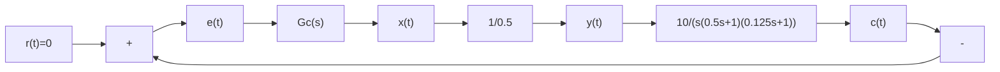

得振荡频率 $\omega=\omega_{x}=7.07$ ，而由

$$
\begin{array}{l} \operatorname{Re} [ G (\mathrm{j} \omega) N (A) ] = \operatorname{Re} [ G (\mathrm{j} \omega_ {x}) ] \cdot N (A) \\ = - N (A) = - 1 \\ \end{array}
$$

可求得振幅 A=2.5。因而非线性系统处于自振荡情况下的非线性环节的输入信号为

$$e (t) = 2. 5 \sin 7. 0 7 t$$

2）为使该系统不出现自振荡，应调整 $K$ 使 $\Gamma_G$ 曲线移动，并和 $-\frac{1}{N(A)}$ 曲线无交点，即应有

$$\frac {- 0 . 0 2}{0 . 3} K > - 0. 5$$

而 $K$ 的临界值应使上述不等式变为等式，即

$$K _ {\max} = \frac {0 . 5 \times 0 . 3}{0 . 0 2} = 7. 5$$

K=7.5 时的 $\Gamma_{G}$ 曲线如图 8-49 中曲线②所示。

例 8-7 设非线性系统如图 8-50 所示, 试采用描述函数法分析:

1) $G_{c}(s) = 1$   
2) $G_{c}(s) = \frac{(0.25s + 1)}{(0.03s + 1)}\cdot \frac{1}{8.3}$

时非线性系统的运动特性。

解 由表 8-1, 死区继电特性的描述函数为

flowchart

图 8-50 例 8-7 非线性系统的结构图

$$N (A) = \frac {4 M}{\pi A} \sqrt {1 - \left(\frac {h}{A}\right) ^ {2}}, \qquad A \geqslant h \tag {8-89}$$

取 $u = \frac{h}{A}$ ，则

$$N (A) = N (u) = \frac {4 M}{\pi h} u \sqrt {1 - u ^ {2}}, \qquad u \geqslant 1 \tag {8-90}$$

对 $N(u)$ 求导数

$$\frac {\mathrm{d} N (u)}{\mathrm{d} u} = \frac {4 M}{\pi h} \left(\sqrt {1 - u ^ {2}} - \frac {u ^ {2}}{\sqrt {1 - u ^ {2}}}\right) = \frac {4 M}{\pi h} \frac {1 - 2 u ^ {2}}{\sqrt {1 - u ^ {2}}}$$

由极值条件 $\frac{\mathrm{d}N(u)}{\mathrm{d}u} = 0$ 得解

$$u _ {m} = \frac {h}{A _ {m}} = \frac {1}{\sqrt {2}}$$

又当 $h \leqslant A < A_m$ 时, $\frac{\mathrm{d}N(u)}{\mathrm{d}u} > 0$ ; 当 $A > A_m$ 时, $\frac{\mathrm{d}N(u)}{\mathrm{d}u} < 0$ , 故 $A_m$ 为 $N(A)$ 的极大值点, 极大值为

$$N (A _ {m}) = \frac {2 M}{\pi h} = 1. 2 7 3, \qquad - \frac {1}{N (A _ {m})} = - 0. 7 8 5$$

而 $-\frac{1}{N(A_m)}$ 亦为 $-\frac{1}{N(A)}$ 的极大值，注意到 $-\frac{1}{N(h)} = -\frac{1}{N(\infty)} = -\infty, -\frac{1}{N(A)}$ 曲线如图8-51所示。

1) $G_{c}(s) = 1$ 。 $\Gamma_G$ 曲线如图8-51中曲线①所示，其中穿越频率

$$\omega_ {x} = \frac {1}{\sqrt {T _ {1} T _ {2}}} = \frac {1}{\sqrt {0 . 5 \times 0 . 1 2 5}} = 4$$

$\Gamma_{G}$ 曲线与负实轴的交点坐标为

$$G (\mathrm{j} \omega_ {x}) = \frac {- K T _ {1} T _ {2}}{T _ {1} + T _ {2}} = \frac {- 1 0 \times 0 . 5 \times 0 . 1 2 5}{0 . 5 + 0 . 1 2 5} = - 1$$

由图可知，在负实轴 $(-1, j0)$ 点处， $\Gamma_G$ 曲线和 $-\frac{1}{N(A)}$ 曲线有两个交点，按式(8-85)解得
