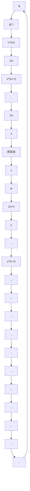
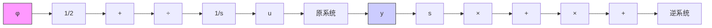

# 3.伪线性系统

将 n 阶积分逆系统和原系统相串联构成复合系统，称为伪线性系统。考虑到微分环节工程上难以实现，故要求 $y, \dot{y}, \cdots, y^{(n-1)}$ 或至少 $y^{(n-1)}$ 可测量。当仅有 $y^{(n-1)}$ 可测量时，需用 n-2 个积分器串联结构获取其余状态。 $y, \dot{y}, \cdots, y^{(n-1)}$ 均可测量时，伪线性系统的结构如图 8-55 所示。图 8-55(a) 为实现形式，图 8-55(b) 为等效环节，因为变换

$$T T _ {n} ^ {\hat {}} y ^ {(n)} = \phi \tag {8-99}$$

其拉氏变换为

$$Y (s) = \frac {1}{s ^ {n}} \Phi (s) \tag {8-100}$$

flowchart

图 8-55 伪线系统结构

若 $y^{(n-1)}$ 不可测量，只有 y 或 $y^{(l)}$ 可测量，则需设计状态观测器，请参阅有关文献。

例8-8 已知某非线性系统的数学模型为

$$\ddot {y} - 2 \dot {y} y + 2 y ^ {2} = u + 2 \dot {u} \tag {8-101}$$

求对应的伪线性系统结构。

解 由原系统方程可得

$$\dot {u} = \frac {1}{2} \ddot {y} - \dot {y} y + y ^ {2} - \frac {1}{2} u \tag {8-102}$$

取伪线性系统的输入为

$$\phi = \ddot {y}$$

则逆系统方程为

$$\dot {u} = \frac {1}{2} \phi - \dot {y} y + y ^ {2} - \frac {1}{2} u \tag {8-103}$$

将式(8-103)代入式(8-101)得

$$\ddot {y} = \phi \tag {8-104}Y (s) = \frac {1}{s ^ {2}} \Phi (s) \tag {8-105}$$

伪线性系统等效为二重积分环节,其实现形式如图 8-56 所示。图中符号“×”表示乘法器。

flowchart

图 8-56 例 8-8 伪线性系统的实现
