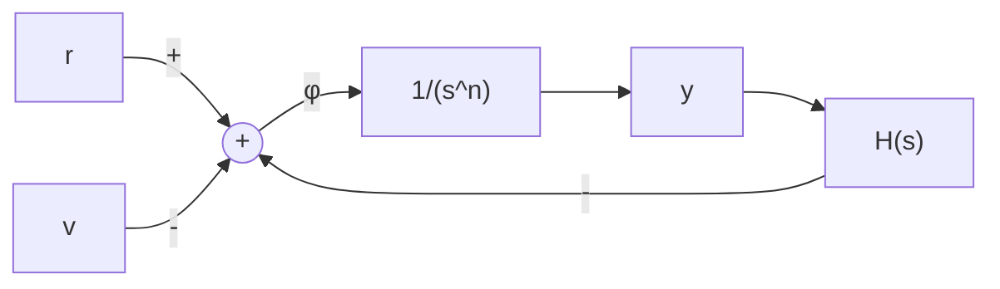

# (1) 状态反馈控制

设 $y, \dot{y}, \cdots, y^{(n-1)}$ 可测量，因此可取状态反馈控制器如图 8-57 所示。其中

$$\phi = r - v, \quad v = \sum_ {i = 0} ^ {n - 1} k _ {i} y ^ {(i)} \tag {8-106}$$

反馈网络传递函数为

$$H (s) = \frac {V (s)}{Y (s)} = \sum_ {i = 0} ^ {n - 1} k _ {i} s ^ {i} \tag {8-107}$$

flowchart

图 8-57 基于伪线性系统的反馈控制

若要求通过外环状态反馈控制器使闭环系统极点位于给定位置,即有

$$\frac {Y (s)}{R (s)} = \frac {1}{s ^ {n} + \sum_ {i = 0} ^ {n - 1} a _ {i} s ^ {i}} \tag {8-108}$$

则由图 8-57, 系统闭环传递函数为

$$\frac {Y (s)}{R (s)} = \frac {\frac {1}{s ^ {n}}}{1 + \frac {1}{s ^ {n}} H (s)} = \frac {1}{s ^ {n} + \sum_ {i = 0} ^ {n - 1} k _ {i} s ^ {i}} \tag {8-109}$$

比较式(8-108)和式(8-109)的分母多项式关于 s 的同次幂的系数, 可得

$$k _ {i} = a _ {i}; \quad i = 0, 1, \dots , n - 1 \tag {8-110}$$
