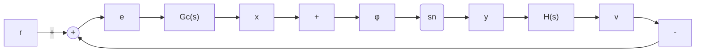

# (2) 渐近跟踪控制

状态反馈可使系统具有较好的动态性能，但对形如 $r(t) = \sum_{i=0}^{l} A_i t^i$ 的多项式输入，不能保证 $\lim_{t \to \infty} e(t) = \lim_{t \to \infty} [r(t) - y(t)] = 0$ 的无静差跟踪。根据时域分析法结果，应使系统开环传递函数具有一定的积分环节个数，可采用图8-58所示的控制结构，即采用串联与局部反馈的综合控制形式。

其中 $G_{c}(s)$ 为串联控制器，具有如下形式：

$$G _ {c} (s) = \frac {\sum_ {i = 0} ^ {l + 1} b _ {i} s ^ {i}}{s ^ {l + 1}} \tag {8-111}$$

flowchart

图 8-58 渐近跟踪控制结构

通过选择控制器参数 $b_{i}(i=0,1,\cdots,l+1)$ 设

置闭环零点和选择参数 $k_{i}(i=0,1,\cdots,n-1)$ 设置闭环极点，可使闭环系统渐近稳定且具有满意的动态特性。

例 8-9 对于例 8-8 所示二阶伪线性系统, 要求实现位置跟踪控制, 试确定控制器结构和参数。

解 位置输入 $r(t) = r_0 \cdot 1(t)$ ，即有 $l = 0$ ，故取

$$G _ {c} (s) = \frac {b _ {0} + b _ {1} s}{s}, \qquad H (s) = k _ {0} + k _ {1} s \tag {8-112}$$

若选定闭环极点 $s_1 = -\sigma, s_{2,3} = -\zeta \omega_n \pm j \omega_n \sqrt{1 - \zeta^2} (\zeta < 1)$ ，则闭环特征方程为

$$
\begin{array}{l} (s + \sigma) (s ^ {2} + 2 \zeta \omega_ {n} s + \omega_ {n} ^ {2}) = s ^ {3} + (\sigma + 2 \zeta \omega_ {n}) s ^ {2} \\ + \left(\omega_ {n} ^ {2} + 2 \zeta \omega_ {n} \sigma\right) s + \alpha \omega_ {n} ^ {2} = 0 \tag {8-113} \\ \end{array}
$$

而由给定的控制器结构,系统闭环传递函数

$$\frac {Y (s)}{R (s)} = \frac {\frac {b _ {0} + b _ {1} s}{s} \cdot \frac {1}{s ^ {2} + k _ {1} s + k _ {0}}}{1 + \frac {b _ {0} + b _ {1} s}{s} \cdot \frac {1}{s ^ {2} + k _ {1} s + k _ {0}}} = \frac {b _ {1} s + b _ {0}}{s ^ {3} + k _ {1} s ^ {2} + (k _ {0} + b _ {1}) s + b _ {0}} \tag {8-114}$$

故有控制器参数

$$
\left\{ \begin{array}{l} b _ {0} = \sigma \omega_ {n} ^ {2} \\ k _ {0} + b _ {1} = \omega_ {n} ^ {2} + 2 \zeta \omega_ {n} \sigma \\ k _ {1} = \sigma + 2 \zeta \omega_ {n} \end{array} \right.
$$

特殊地，选择

$$\frac {b _ {0}}{b _ {1}} = \sigma$$

则得 $b_{1} = \omega_{n}^{2},\quad k_{0} = 2\zeta \omega_{n}\sigma$

此时系统闭环传递函数为

$$\frac {Y (s)}{R (s)} = \frac {\omega_ {n} ^ {2} (s + \sigma)}{(s ^ {2} + 2 \zeta \omega_ {n} s + \omega_ {n} ^ {2}) (s + \sigma)} = \frac {\omega_ {n} ^ {2}}{s ^ {2} + 2 \zeta \omega_ {n} s + \omega_ {n} ^ {2}} \tag {8-115}$$
