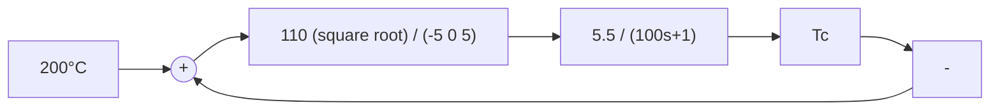
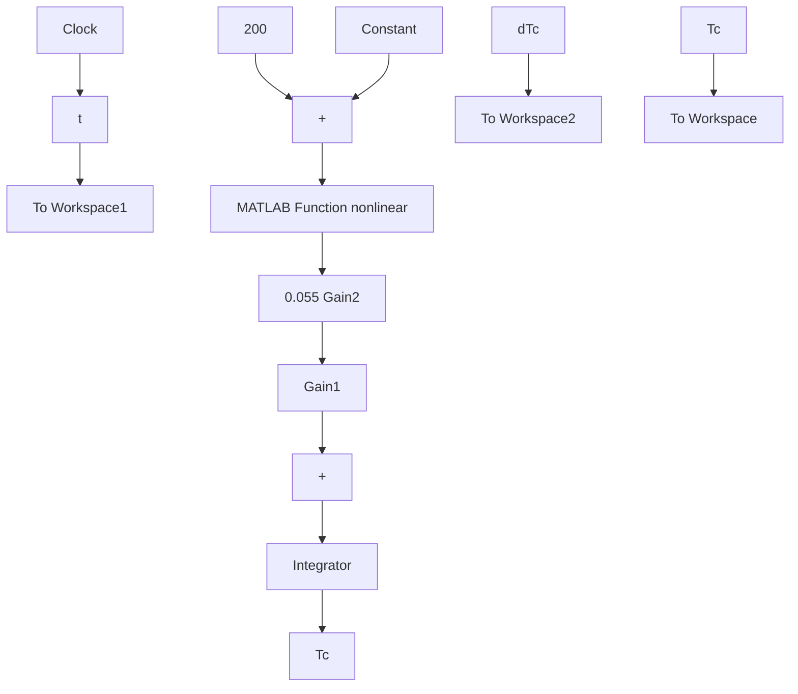

# 8-6 非线性控制系统设计

例 8-10 恒温箱温度控制。设恒温箱动态结构图如图 8-59 所示。若要求温度保持 $200^{\circ}C$ ，恒温箱由常温 $20^{\circ}C$ 启动，试在 $T_{c}-\dot{T}_{c}$ 相平面上作出温度控制的相轨迹，并计算升温时间和保持温度的精度，最后进行 MATLAB 验证。


<details>
<summary>flowchart</summary>


</details>

图 8-59 恒温箱结构图

解 由图 8-59 可得系统分段微分方程为

$$
1 0 0 \dot {T} _ {c} + T _ {c} = \left\{ \begin{array}{l l} 6 0 5, & \left\{ \begin{array}{l} T _ {c} <   1 9 5 \\ T _ {c} <   2 0 5, \dot {T} _ {c} > 0 \end{array} \right. \\ 0, & \left\{ \begin{array}{l} T _ {c} > 2 0 5 \\ T _ {c} <   1 9 5, \dot {T} _ {c} <   0 \end{array} \right. \end{array} \right.
$$

相应的相轨迹如图 8-60 所示。相轨迹在开关线上跳至另一条相轨迹。

升温时间：在升温时，相轨迹沿图8-60中AB运动。AB段对应的相轨迹方程为

$$
\begin{array}{l} \dot {T} _ {c} = \frac {(6 0 5 - T _ {c})}{1 0 0} \\ t _ {r} = \int_ {2 0} ^ {2 0 0} \frac {\mathrm{d} T _ {c}}{\dot {T} _ {c}} = \int_ {2 0} ^ {2 0 0} \frac {1 0 0}{6 0 5 - T _ {c}} \mathrm{d} T _ {c} \\ = 1 0 0 \ln \frac {5 8 5}{4 0 5} = 3 6. 7 7 \mathrm{s} \\ \end{array}
$$


<details>
<summary>line</summary>

| Point | Temperature (°C) |
| --- | --- |
| A | 20 |
| B | 200 |
</details>

图 8-60 恒温箱温度控制系统

MATLAB 验证：应用 MATLAB 软件包，在 Simulink 环境下搭建如图 8-61 所示的温控系统仿真模型，其中 MATLAB Function 环节的调用函数为 M 文件 fun.m，运行它可在相平面上精确绘出 $T_{c}-\dot{T}_{c}$ 相轨迹，同时也可绘出恒温箱温度控制系统的时间响应曲线，如图 8-62 中的 (a)，(b) 所示，最后测得：升温时间 $t_{r}=36.96s$ ，保温精度为 $\pm5^{\circ}C$ 。

MATLAB Function 环节的调用函数：

```matlab
function y=fun(u)
if ((u(2)>=5) | ((u(2)>=-5)&(u(1)>=0)))
y=110;
else y=0
end 
```


<details>
<summary>flowchart</summary>


</details>

图 8-61 Simulink 环境下的温控系统仿真模型


<details>
<summary>line</summary>

| T_c | ic |
| --- | --- |
| 0 | 6.0 |
| 50 | 5.5 |
| 100 | 5.0 |
| 150 | 4.5 |
| 200 | 4.0 |
| 200 | -2.0 |
| 250 | -2.0 |
</details>
