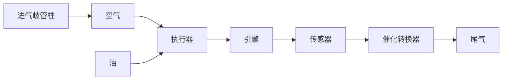

# 例 8-12 汽车引擎的油-气比控制

早期汽车引擎采用汽化器来量测燃料量，使得油-气比(F/A)保持在1:15附近。这种装置使通过文氏管的空气流引起汽油压力下降而获得测量值。在保持引擎良好运行方面，该装置效果足够好，但是它会允许达20%的F/A偏移，从而会产生过量的碳氢化合物(HC)和过剩氧量而造成环境污染。在20世纪70年代，汽车公司改善了汽化器设计法和生产流程，使得测量装置更精确且F/A精确度在3%\~5%附近，从而降低了尾气污染水平。但是，汽化器依然是一个开环系统，因为系统没有测量进入发动机的混合气体的F/A，并将它反馈给汽化器。到了20世纪80年代,几乎所有制造商都采用反馈控制系统来提高 F/A 精度,以降低尾气中污染物的数量。

汽车发动机控制典型反馈系统的设计，按如下步骤进行。

步骤1 理解过程及其性能指标。为达到尾气污染排放指标，选取的方法中用到一个催化式排气净化器，它能同时氧化过量的一氧化碳(CO)和未燃烧的碳氢化合物(CH)，减少过量的氮氧化合物(NO、NO₂)。该装置常称作三用催化剂，因为其能作用于三种污染物。在F/A与化学计量比与1:14.7相比差别1%以上时，此催化剂失效；因此，反馈控制系统都要求F/A保持在理想水平±1%以内。系统如图8-66描述。

flowchart

图 8-66 F/A 反馈控制系统

影响从尾气中测量 F/A 输出与进气歧管柱的燃料之间关系的动态因素有:①油气混合物吸入量;②引擎中活塞冲程引起的循环时滞;③尾气从引擎进入传感器的时间。这些因素都与发动机速度和负载有很大的关系。当司机通过改变油门踏板来获得或多或少的功率时,系统在变化发生后的很短时间内完成瞬态过程。在理想情况下,反馈控制系统应当跟随瞬态效应。

步骤2 选择传感器。尾气传感器选用锆氧化物传感器，其发明和发展是使得反馈控制减少尾气排放的设想可行的关键技术。设备中的活性元素锆氧化物置于尾气流中，产生一个关于尾气含氧量的单调电压函数。F/A与氧气水平存在一一对应的关系。传感器电压与F/A呈高度非线性关系；几乎所有的电压变化都精确地发生在某F/A值上。当F/A处于期望点(1：14.7)的情况下，传感器的增益很高；而在偏移1：14.7的情况下，增益会大幅下降。

步骤3 选择执行器。燃料测量可以依靠汽化器或者燃料射入器完成。一个完善的反馈F/A系统需要有电子式装置调整燃料测量的能力，汽化器通过可调节孔来对电子误差信号作出响应，以调整主要燃料的流量，并通过使用燃料射入器实现测量。燃料射入器系统是典型的电子装置，所以能利用来自传感器的反馈信号，对F/A反馈实现燃料调整。现在，燃料射入器置于气缸入口(称多点射入)处，由于燃料的注入更贴近引擎，在气缸中分布得更好，且还能减少时间滞后，于是产生更好的引擎响应，目前被广泛采用。

步骤4 建立理想线性模型。传感器输出特性如图8-67所示，其非线性度很大。图8-68给出了系统的结构图，传感器的增益为 $K_{s}$ 。 $\tau_{1}$ 和 $\tau_{2}$ 分别代表蒸汽或水滴形式的快速燃料流和附在多支管上液体膜形式的慢速燃料流的时间常数。

系统中还存在时滞环节,其时滞由以下两部分组成:①活塞从进气到排气过程的四冲程时间;②尾气从引擎到传感器的传输时间。时间常数 $\tau$ 的传感器滞后也包括在该过程中,表征发生在尾气支管内的混合过程。虽然时间常数和滞后时间会因发动机负载和速度的不同发生很大的改变,但是可以在一个确定的点对设计进行检验,这里的各参数取为

$$\tau_ {1} = 0. 0 2 \mathrm{s}, \quad T _ {d} = 0. 2 \mathrm{s}\tau_ {2} = 1 \mathrm{s}, \quad \tau = 0. 1 \mathrm{s}$$

在实际的引擎中,设计要适用于所有速度和负载。

line

| 油-气比 | 传感器输出, v |
| --- | --- |
| 1:18 | 0.1 |
| 1:14.7 | 0.9 |
| 1:12 | 0.9 |

图 8-67 尾气传感器输出
