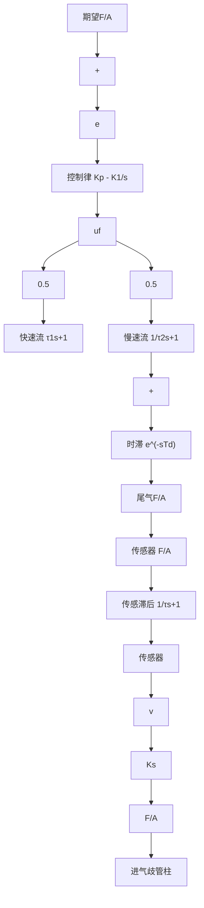

<details>
<summary>flowchart</summary>


</details>

图 8-68 F/A 控制系统的结构图

步骤5 设计PID控制器。给定严格的误差指标以及由不同的发动机运行状态决定的燃料需求量 $u_{f}$ ，因此积分控制环节是必需的。有了积分控制，在误差信号 $e = 0$ 的条件下，能提供任何需要的稳定状态 $u_{f}$ 。比例环节的加入，可以增加带宽，且不损害系统的稳定特性。在这个例子中，我们采用比例加积分的控制律(PI)。控制律的输出驱动射入器的脉冲发生器产生一个燃料脉冲，该燃料脉冲的持续时间与电压成正比例。控制器的传递函数可以写为

$$G _ {c} (s) = K _ {p} + \frac {K _ {I}}{s} = \frac {K _ {p}}{s} (s + z)$$

其中 $z = \frac{K_1}{K_p}$ , $z$ 可以按期望的要求进行选择。

首先，假设传感器是线性的，且可以由增益 $K_{s}$ 代表，然后可以选择 $z$ ，使得系统具有良好的稳定性和系统响应。线性分析表明，通过PI控制器可以在合理带宽(1Hz)下实现满意的稳定性，但是从传感器的非线性特性(图8-67)可知，这是不可能达到的。注意，在期望设置点附近时，传感器输出的斜率特别大，于是导致非常大的 $K_{s}$ 值。因此，在传感器高增益的情况下，需要用较低的控制器增益 $K_{p}$ 。另一方面，在 $\mathrm{F / A = 1:14.7(= 0.068)}$ 时，使系统稳定的 $K_{p}$ 值非常小, 这将放缓偏离设置点很大程度的动态响应, 因为这时有效的传感器增益大幅度下降。因此, 为了使设置点在任何干扰下都有满意的响应特性, 必须解决传感器的非线性。传感器的一阶近似如图 8-69 所示。因为在设置点处实际的传感器增益依然与近似值有很大的不同, 且线性分析时未考虑时滞环节 $e^{-0.2s}$ , 对设置点附近的稳定性会产生不利影响, 故该近似分析将得出错误的结论; 然而, 在仿真时, 用它来确定对初始状况的响应还是有用的。


<details>
<summary>line</summary>

| 油气比 | 实际传感器 | 近似值 |
| --- | --- | --- |
| 1:18 | 0.1 | 0.1 |
| 1:14.7 | 0.5 | 0.5 |
| 1:12 | 0.9 | 0.9 |
</details>

图 8-69 传感器的近似

步骤6 非线性的设计仿真。在Simulink中实现的系统非线性闭环仿真如图8-70所示。MATLAB函数(fas)给出图8-70中传感器近似的非线性特性。

MATLAB 函数：

```matlab
function y=fas(u)
if u<0.0606
    y=0.1;
elseif u>0.0741
    y=0.9;
else y=0.1+(u-0.0606)*78.5;
end 
```


<details>
<summary>flowchart</summary>
