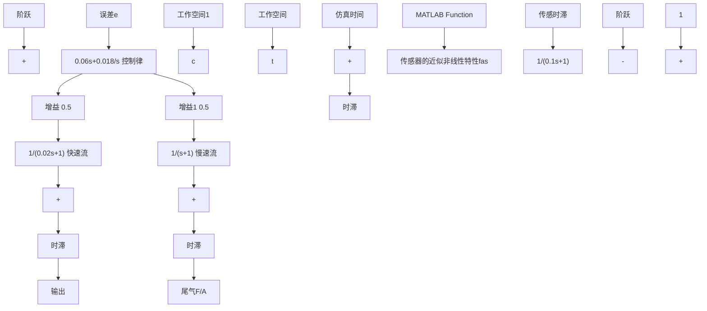

图 8-70 Simulink 实现的闭环非线性仿真

图 8-71(a) 和图 8-71(b) 是使用如图 8-69 的传感器，且 $k_{p}=0.6, z=0.3$ 时得到的仿真曲线。在该增益下，线性系统是不稳定的，且信号上升维持大约 5s。在此之后信号不再上升，但是由于当传感器增益有输入时的非线性度增大，其有效增益受饱和效应的影响而减弱，最后达到一个极限环。在非线性输入的情况下，系统的动态响应如图 8-71(b) 所示。
