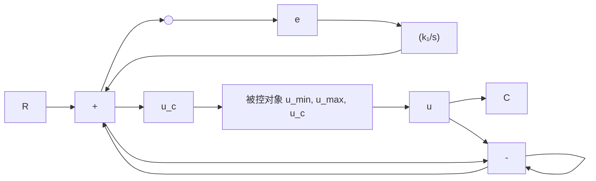

# 例 8-13 积分器抗饱和漂移控制

在任何控制系统中执行器的输出都会达到饱和,这是因为所有实际执行器的动态区间都是有限的。例如航天器的操纵面从其标称位置的漂移不能超过特定的角度，电子放大器只能产生有限的电压输出等等。不论什么时候执行器出现饱和，过程的控制信号就会停止变化，且反馈回路也有效地敞开了。在这种情况下，若误差信号继续被施加给积分输入，则积分输出将增加（漂移）直到误差信号变化，积分作用回转，结果可能导致一个很大的超调量和很差的动态响应。

line

| t/s | e/t |
| --- | --- |
| 0 | 0.6 |
| 1 | 0.6 |
| 2 | 0.6 |
| 3 | 0.4 |
| 4 | 0.6 |
| 5 | -0.2 |
| 6 | 0.6 |
| 7 | -0.4 |
| 8 | 0.6 |
| 9 | -0.4 |
| 10 | 0.6 |
| 11 | -0.4 |
| 12 | 0.6 |
| 13 | -0.4 |
| 14 | 0.6 |
| 15 | -0.4 |
| 16 | 0.6 |
| 17 | -0.4 |
| 18 | 0.6 |
| 19 | -0.4 |
| 20 | 0.6 |

(a)

line

| t/s | F/A |
| --- | --- |
| 0 | 0.01 |
| 2 | 0.04 |
| 4 | 0.06 |
| 6 | 0.07 |
| 8 | 0.08 |
| 10 | 0.085 |
| 12 | 0.085 |
| 14 | 0.085 |
| 16 | 0.085 |
| 18 | 0.085 |
| 20 | 0.085 |

(b)   
图 8-71 带有非线性传感器近似的系统响应(MATLAB)

flowchart

图 8-72 带执行器饱和的反馈系统

考虑如图8-72所示的反馈系统。假定一个给定的参考阶跃信号比引起执行器达到饱和值 $u_{\mathrm{max}}$ 的输入还大得多，由于积分器继续对误差 $e$ 做积分运算，使信号 $u_{c}$ 持续增大，从而被控对象的输入被锁定在其最大值，即 $u = u_{\mathrm{max}}$ ，所以误差仍然很大，直到被控对象的输出超出参考值，误差值改变符号。而 $u_{c}$ 的增加是不利的，因为进入被控对象的输入没有变化，但如果饱和持续很长一段时间， $u_{c}$ 可能会变得非常大，这将导致一个相当大的负误差 $e$ ，而且产生的很差的动态响应将把积分器输出带回到控制不饱和的线性段。

如果在系统中加入一个积分器抗漂移电路，当执行器饱和时，它可以“关掉”积分作用。若控制器是用数字电路实现的，则用逻辑很容易实现这个功能，即通过包括一个像“if $|u|=u_{max}$ ， $k_{I}=0$ ”的语句。图8-73(a)和图8-73(b)给出了一个PI控制器装置的两个等效的抗漂移方案。图8-73(a)所示的方法更容易理解一些，而图8-73(b)所示的方法更容易实现，因为它不需要一个独立的非线性项而只是利用饱和本身。在这些方案中，只要执行器饱和，积分器附近的反馈回路就开始激活，使得在 $e_1$ 处的积分器输入较小。这时，积分器本质上变成了一个快速的一阶超前装置。为了看出这一点，重画图8-73(a)中从 $e$ 到 $u_c$ 这部分的方框，如图8-73(c)所示，则积分器变成了图8-73(d)所示的一阶超前装置。抗偏移增益 $K_a$ 应选得足够大，以使得抗漂移电路在所有误差情况下保持进入积分器的输入都很小。

flowchart

