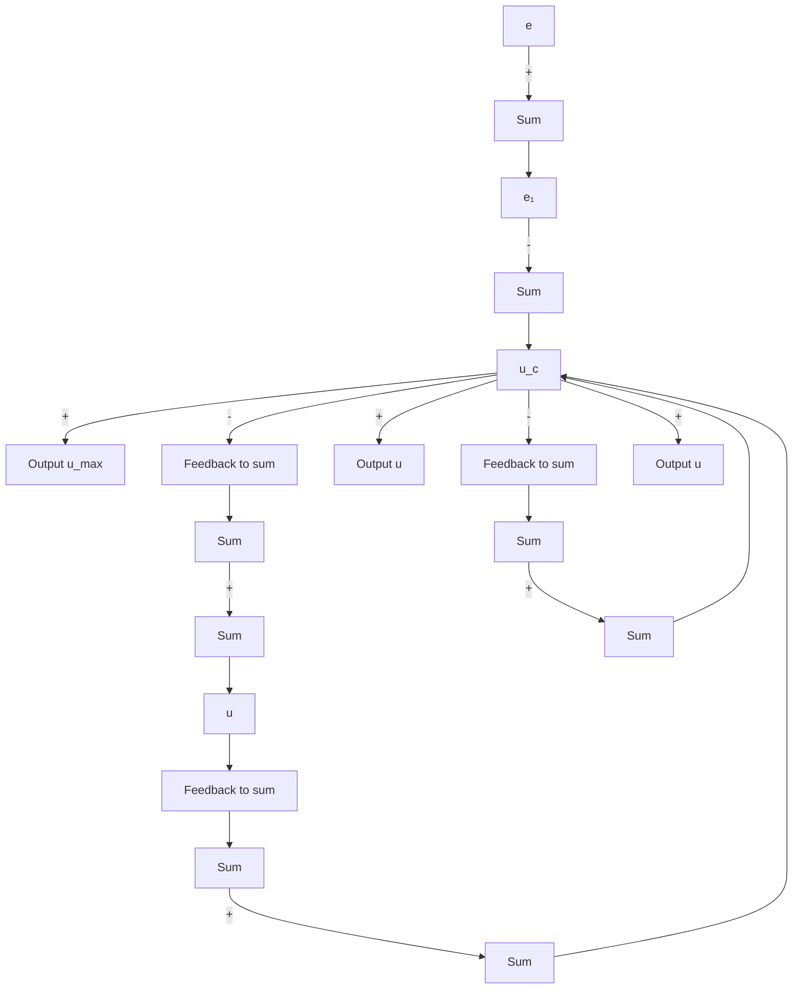
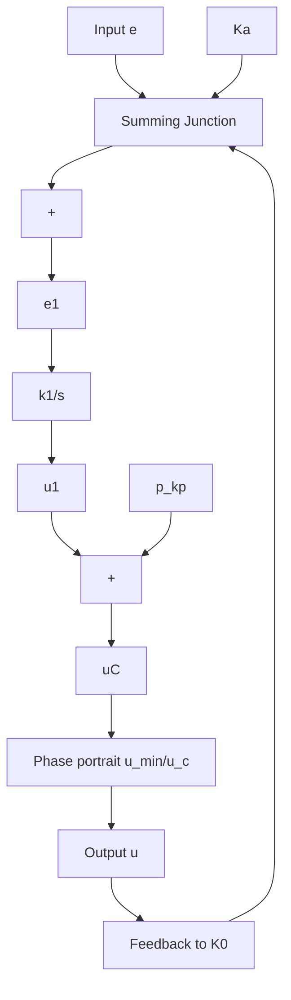
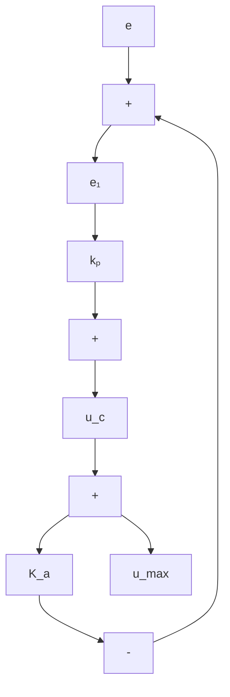
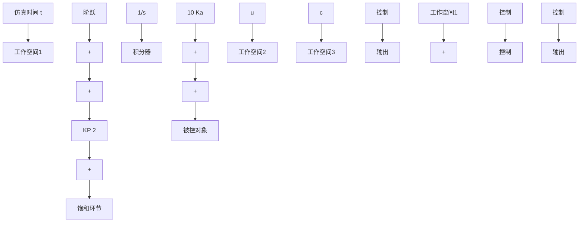

(a) 带抗漂移的PI控制器

flowchart

(b) 带单非线性的抗漂移实现

flowchart

(c) 饱和时的等效框图

  
(d) 饱和时抗漂移积分器的一阶超前等效   
图 8-73 积分抗漂移方案

抗漂移的作用是在反馈系统中降低超调量和控制量。这种抗漂移方案的实现，在任何实际的积分控制应用中都是必需的，忽略这种方法可能导致系统响应的严重退化。从稳定性的角度来说，饱和作用是打开反馈回路，将留下的常量输入的开环对象和控制器当做系统误差为输入的开环系统。

抗漂移的目的是当主环被信号饱和打开时，提供一个局部的反馈使得控制器稳定。

现在,考虑一个对象,其针对小信号传递函数为

$$G (s) = \frac {1}{s}$$

且在单位反馈结构中的 PI 控制器为

$$G _ {c} (s) = k _ {p} + \frac {k _ {I}}{s} = 2 + \frac {4}{s}$$

设被控对象的输入被限制在 $\pm1.0$ ，试研究抗漂移控制对系统响应的影响。

解 假定采用一个反馈增益为 $K_{a} = 10$ 的抗漂移电路，如图8-74所示的Simulink框图。图8-75(a)给出了系统有抗漂移措施和没有抗漂移措施时的阶跃响应。图8-75(b)给出了相应的控制量。仿真结果表明，带抗漂移的系统实质上有更小的超调量和更小的控制量。

flowchart

图 8-74 抗漂移的例子(Simulink 框图)

line

| 时间/s | 不带抗漂移 | 带抗漂移 |
| --- | --- | --- |
| 0 | 0.0 | 0.0 |
| 1 | 1.0 | 1.0 |
| 2 | 1.5 | 1.2 |
| 3 | 1.4 | 1.0 |
| 4 | 1.0 | 0.9 |
| 5 | 1.0 | 1.0 |
| 6 | 1.0 | 1.0 |
| 7 | 1.0 | 1.0 |
| 8 | 1.0 | 1.0 |
| 9 | 1.0 | 1.0 |
| 10 | 1.0 | 1.0 |

(a) 阶跃响应

line

| 时间/s | 带抗漂移 | 不带抗漂移 |
| --- | --- | --- |
| 0 | 1.0 | 1.0 |
| 1 | 0.5 | 0.8 |
| 2 | -0.2 | -0.4 |
| 3 | -0.1 | -0.6 |
| 4 | 0.0 | 0.1 |
| 5 | 0.0 | 0.0 |
| 6 | 0.0 | 0.0 |
| 7 | 0.0 | 0.0 |
| 8 | 0.0 | 0.0 |
| 9 | 0.0 | 0.0 |
| 10 | 0.0 | 0.0 |

(b) 控制作用  
图 8-75 积分器抗漂移效果(Simulink)
